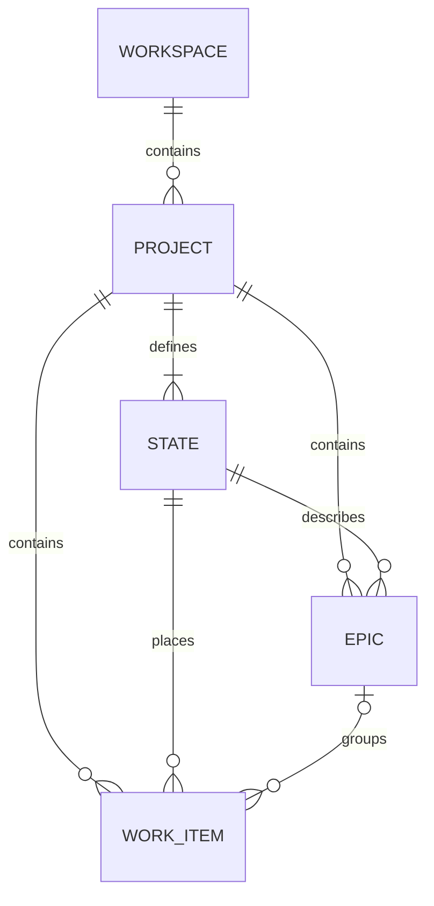

# Контракт MVP управления проектами на основе frontend Plane

Статус: `Ready for implementation`  
Версия документа: `1.0`  
Дата исследования: `2026-08-10`  
Язык интерфейса: русский  
Язык API и программных идентификаторов: английский  

## Содержание

- [1. Резюме решения](#1-резюме-решения)
- [2. Основание и границы исследования Plane](#2-основание-и-границы-исследования-plane)
- [3. Scope MVP](#3-scope-mvp)
- [4. Термины и доменная модель](#4-термины-и-доменная-модель)
- [5. Роли и права](#5-роли-и-права)
- [6. User scenarios](#6-user-scenarios)
- [7. Информационная архитектура и маршруты](#7-информационная-архитектура-и-маршруты)
- [8. UI/UX-стек для React](#8-uiux-стек-для-react)
- [9. Архитектура frontend](#9-архитектура-frontend)
- [10. Общие UI/UX-правила](#10-общие-uiux-правила)
- [11. Экран списка проектов](#11-экран-списка-проектов)
- [12. Экран канбан-доски](#12-экран-канбан-доски)
- [13. Карточка: drawer и полноэкранный режим](#13-карточка-drawer-и-полноэкранный-режим)
- [14. Экран эпиков](#14-экран-эпиков)
- [15. Эпик: drawer и управление карточками](#15-эпик-drawer-и-управление-карточками)
- [16. Настройки проекта и колонок](#16-настройки-проекта-и-колонок)
- [17. Контракт React-компонентов](#17-контракт-react-компонентов)
- [18. API Contract](#18-api-contract)
- [19. Системные потоки и согласованность данных](#19-системные-потоки-и-согласованность-данных)
- [20. Нефункциональные требования](#20-нефункциональные-требования)
- [21. Стратегия тестирования](#21-стратегия-тестирования)
- [22. Definition of Done](#22-definition-of-done)
- [23. Источники](#23-источники)

## 1. Резюме решения

MVP — это компактное приложение управления работой внутри существующего workspace. Пользователь создаёт проект, получает четыре стандартные колонки, создаёт карточки, перемещает их по канбану, объединяет карточки в эпики и видит прогресс эпиков.

Из Plane сохраняются главные продуктовые паттерны:

- проект как верхнеуровневый контейнер;
- проектная навигация и отдельные экраны Work items/Epics;
- колонки канбана как состояния проекта;
- быстрый ввод карточки в колонке;
- карточка канбана с настраиваемым набором свойств;
- desktop drawer для быстрого просмотра и отдельный URL для прямой ссылки;
- оптимистичное перемещение карточек с откатом при ошибке;
- курсорная пагинация отдельно внутри каждой колонки;
- серверная проверка прав, а не только скрытие UI-действий.

MVP сознательно не копирует всю функциональность Plane. Он предоставляет только проекты, состояния/колонки, эпики, карточки и канбан. Единственный основной layout карточек — Kanban.

## 2. Основание и границы исследования Plane

### 2.1 Исследованный срез

Исследован публичный репозиторий `makeplane/plane`, ветка `preview`, commit [`31853ab2b8b7810c59dc30d22e52c8f4b5a71a47`](https://github.com/makeplane/plane/tree/31853ab2b8b7810c59dc30d22e52c8f4b5a71a47) от 2026-08-05, версия монорепозитория `1.4.1`.

Проверены:

- маршруты и project layout в `apps/web/app`;
- экраны проектов в `apps/web/core/components/project*`;
- Work item layouts и Kanban в `apps/web/core/components/issues/issue-layouts`;
- project/issue/state services;
- MobX stores и SWR-bootstrap;
- типы Project, State, Issue и Epic;
- пакеты `@plane/ui` и `@plane/propel`;
- официальная документация Plane по Projects, Work items, Layouts, Display options и Epics.

### 2.2 Факты, перенесённые из Plane

| Наблюдение | Следствие для MVP |
| --- | --- |
| Web-клиент — React/TypeScript-приложение на React Router и Vite | Используется тот же базовый технологический контур |
| Plane хранит доменные данные в MobX stores и инициирует загрузку экранов через SWR | MVP разделяет normalized domain state и request lifecycle аналогичным образом |
| `@plane/ui` и `@plane/propel` дают собственную дизайн-систему | В MVP нужен локальный `@app/ui`, а не прямое связывание feature-кода с headless-библиотекой |
| Канбан реализован через Atlassian Pragmatic Drag and Drop, auto-scroll и hitbox | Для DnD выбрана та же библиотека |
| При переходе к Kanban Plane принудительно задаёт `group_by=state`, если группировка не выбрана | В MVP канбан всегда группируется по состоянию; пользователь не меняет ось группировки |
| Plane использует quick add в колонке, skeleton/empty/error states и подгрузку по колонкам | Эти состояния являются обязательными, а не факультативными |
| Карточка открывается в side peek на desktop и отдельной страницей на mobile | В MVP используется route-aware drawer и полноэкранный fallback |
| В Plane drag обновляет состояние и `sort_order`; порядок вычисляется между соседями | В MVP сервер владеет ранжированием, а frontend передаёт соседей, чтобы избежать гонок |

### 2.3 Важный разрыв по Epics

Публичный frontend-срез содержит:

- `EIssueServiceType.EPICS` и endpoint-маршрутизацию `/epics/`;
- `EIssuesStoreType.EPIC` и отдельные epic stores/filters;
- поддержку `isEpic` в общих List/Kanban/Calendar/Gantt/Spreadsheet primitives;
- URL mapping на `/:workspaceSlug/projects/:projectId/epics`;
- API-типы и официальный публичный API Epics.

При этом в исследованном commit компонент `CreateUpdateEpicModal` в публичном core возвращает пустой fragment, а конкретного open-source route-файла экрана Epics в `apps/web/app` нет. Поэтому UI эпиков ниже является проектируемой MVP-реализацией на общих паттернах Plane и подтверждённом Epic API, а не буквальной копией законченного CE-экрана.

### 2.4 Лицензия

Plane распространяется под AGPL-3.0. Этот документ описывает продуктовый и технический контракт, но не переносит код Plane. Если команда решит копировать исходники, стили или внутренние UI-пакеты Plane, требуется отдельная проверка лицензионных обязательств.

## 3. Scope MVP

### 3.1 Входит в MVP

1. Проекты:
   - список, поиск и фильтрация активных/архивных проектов;
   - создание и редактирование проекта;
   - архивирование и восстановление проекта;
   - проектные роли `admin`, `member`, `viewer`;
   - настройка колонок проекта.
2. Карточки (`WorkItem`):
   - создание через quick add или полную форму;
   - чтение и редактирование свойств;
   - удаление с подтверждением;
   - назначение исполнителей из существующих участников проекта;
   - связь максимум с одним эпиком;
   - перемещение между колонками и изменение ручного порядка.
3. Канбан:
   - колонки по состояниям проекта;
   - горизонтальный desktop layout;
   - адаптивный mobile layout;
   - DnD с auto-scroll;
   - доступная альтернатива DnD через диалог «Переместить»;
   - поиск и фильтры;
   - курсорная подгрузка карточек по колонкам;
   - персональные display preferences.
4. Эпики:
   - список, создание, редактирование и удаление;
   - добавление/исключение карточек;
   - агрегированный прогресс по завершённым карточкам;
   - фильтр канбана по эпику.
5. Состояния проекта:
   - создание, переименование, смена цвета и semantic group;
   - изменение порядка колонок;
   - удаление пустой колонки или перенос её карточек в другую колонку.

### 3.2 Не входит в MVP

- регистрация, вход, SSO и восстановление пароля;
- создание workspace и управление workspace;
- приглашения, управление участниками и командами;
- cycles/sprints, modules, initiatives, milestones и releases;
- custom views, spreadsheet, list, calendar, timeline и Gantt layouts;
- inbox/intake, drafts и triage;
- комментарии, activity feed, reactions и подписки;
- вложения, ссылки, relations и зависимости;
- sub-work items и иерархия карточек;
- labels, custom fields, estimates и time tracking;
- аналитика, dashboards и отчёты;
- templates, import/export, integrations и webhooks;
- realtime collaboration, presence и WebSocket-синхронизация;
- public boards и гостевые публичные ссылки;
- AI, automations и command palette;
- hard delete проекта.

### 3.3 Предпосылки

- Пользователь уже аутентифицирован платформой.
- `workspace_slug`, текущий пользователь и membership доступны frontend до открытия проектных экранов.
- Участники проекта приходят из внешнего identity/membership-контура как read-only lookup.
- Backend применяет tenant isolation по workspace и project на каждом запросе.
- Все даты свойств карточки/эпика — date-only (`YYYY-MM-DD`), а системные timestamps — UTC ISO 8601.

## 4. Термины и доменная модель

| Термин UI | Термин API | Определение |
| --- | --- | --- |
| Workspace | `Workspace` | Уже существующий tenant-контекст; управлять им в MVP нельзя |
| Проект | `Project` | Контейнер колонок, карточек и эпиков |
| Колонка/состояние | `State` | Этап workflow проекта и колонка канбана |
| Карточка | `WorkItem` | Основная единица работы |
| Эпик | `Epic` | Крупная единица работы, объединяющая карточки одного проекта |
| Ручной порядок | `rank` | Непрозрачный серверный ключ сортировки карточек внутри колонки |
| Semantic group | `StateGroup` | Один из `backlog`, `unstarted`, `started`, `completed`, `cancelled` |



### 4.1 Инварианты

- `Project.identifier` уникален без учёта регистра в пределах workspace.
- У проекта всегда есть минимум одно состояние.
- Ровно одно активное состояние проекта имеет `is_default=true`.
- Состояние карточки и состояние эпика принадлежат тому же проекту.
- Карточка принадлежит ровно одному проекту и не более чем одному эпику.
- Карточку нельзя связать с эпиком другого проекта.
- Исполнитель должен быть активным участником проекта.
- `start_date <= due_date`, если обе даты заданы.
- Прогресс эпика вычисляется backend: число активных карточек в состояниях semantic group `completed`, делённое на число всех активных карточек эпика.
- Архивный проект доступен только для чтения до восстановления.
- Удаление эпика не удаляет карточки; `epic_id` карточек становится `null`.
- Удаление состояния с карточками требует `replacement_state_id`.
- Клиент не вычисляет и не сохраняет `rank` самостоятельно.

## 5. Роли и права

Frontend получает не только `role`, но и вычисленные `permissions`. UI ориентируется на permissions, backend повторно проверяет каждое действие.

| Действие | `admin` | `member` | `viewer` |
| --- | :---: | :---: | :---: |
| Открыть проект, канбан и эпики | Да | Да | Да |
| Создать проект | Зависит от workspace permission | Зависит от workspace permission | Нет |
| Изменить/архивировать проект | Да | Нет | Нет |
| Управлять колонками | Да | Нет | Нет |
| Создать карточку | Да | Да | Нет |
| Изменить/переместить карточку | Да | Да | Нет |
| Удалить любую карточку | Да | Нет | Нет |
| Удалить собственную карточку | Да | Да | Нет |
| Создать/изменить эпик | Да | Да | Нет |
| Удалить любой эпик | Да | Нет | Нет |
| Удалить собственный эпик | Да | Да | Нет |
| Менять только персональные display preferences | Да | Да | Да |

Обязательные permission flags:

```txt
can_view_project
can_edit_project
can_archive_project
can_manage_states
can_create_work_item
can_edit_work_item
can_move_work_item
can_delete_own_work_item
can_delete_any_work_item
can_create_epic
can_edit_epic
can_delete_own_epic
can_delete_any_epic
```

## 6. User scenarios

### US-01. Просмотр и поиск проектов

**Роль:** любой участник workspace.  
**Предусловие:** пользователь аутентифицирован и открыл `/:workspaceSlug/projects`.

Основной поток:

1. Система показывает skeleton карточек проектов.
2. Backend возвращает только проекты, которые пользователь вправе видеть.
3. Пользователь вводит часть названия или identifier.
4. Поиск применяется с debounce 250 мс и отражается в query string.
5. Пользователь открывает проект; система ведёт на его канбан.

Альтернативы:

- Нет проектов: показывается empty state с CTA «Создать проект», если есть право.
- Нет результатов фильтра: показывается фильтрованный empty state и действие «Сбросить фильтры».
- Проект архивирован: карточка имеет badge «Архив», открывается read-only.
- Ошибка загрузки: inline error с `request_id` и кнопкой «Повторить».

Критерии приёмки:

- Поиск не отправляется для пустой строки.
- URL с фильтром восстанавливает состояние после reload/back/forward.
- Viewer не видит create CTA.

### US-02. Создание проекта

**Роль:** пользователь с `can_create_project` на уровне workspace.

Основной поток:

1. Пользователь нажимает «Новый проект».
2. Открывается modal с полями: название, identifier, описание, цвет/emoji, доступ.
3. Identifier автоматически строится из названия, переводится в uppercase и остаётся редактируемым.
4. После локальной валидации отправляется `POST /projects` с `Idempotency-Key`.
5. Backend создаёт проект, добавляет создателя как `admin` и создаёт четыре стандартных состояния.
6. Modal закрывается; toast содержит действие «Открыть проект».

Стандартные состояния:

| Название UI | `group` | `is_default` |
| --- | --- | :---: |
| Бэклог | `backlog` | Нет |
| К выполнению | `unstarted` | Да |
| В работе | `started` | Нет |
| Готово | `completed` | Нет |

Ошибки:

- `PROJECT_IDENTIFIER_TAKEN`: ошибка показывается под identifier, modal остаётся открыт.
- `VALIDATION_ERROR`: ошибки привязываются к полям.
- Network error после неизвестного результата: повтор использует тот же `Idempotency-Key`.

### US-03. Изменение, архивирование и восстановление проекта

**Роль:** `admin`.

Основной поток редактирования:

1. Пользователь открывает «Настройки проекта».
2. Меняет название, identifier, описание, icon/color или access.
3. `PATCH` отправляет только изменённые поля.
4. UI обновляет breadcrumb, sidebar и project card из одного normalized store.

Архивирование:

1. В danger zone показываются количества карточек и эпиков.
2. Пользователь подтверждает названием проекта.
3. Проект становится read-only и исчезает из активного списка.
4. Прямые ссылки продолжают открываться с archive banner.

Восстановление возвращает проект и все дочерние данные в активный режим.

### US-04. Открытие канбана

**Роль:** `admin`, `member` или `viewer`.

Основной поток:

1. Route загружает единый board snapshot: проект, permissions, состояния, первые страницы карточек, эпики и участников.
2. Пока snapshot не получен, показывается layout skeleton с колонками.
3. Колонки рисуются по `position`, карточки — по серверному `rank`.
4. Состояние фильтров восстанавливается из URL, display preferences — из backend preferences.
5. Следующие страницы подгружаются независимо в каждой колонке.

Критерии:

- Пустая колонка остаётся видимой и содержит quick add для редактора.
- Если вся доска пуста, показываются колонки и onboarding hint, а не полноэкранный empty state.
- Архивный проект показывает доску без mutating controls.

### US-05. Быстрое создание карточки в колонке

**Роль:** `admin` или `member`.

1. Пользователь нажимает `+` или поле «Добавить карточку» в нужной колонке.
2. Встроенный input получает фокус.
3. `Enter` создаёт карточку с указанным `state_id`; `Shift+Enter` переносит строку; `Escape` отменяет.
4. Frontend немедленно добавляет временную карточку в начало колонки.
5. После ответа временный ID заменяется серверным без скачка позиции.
6. Действие «Открыть» в toast открывает drawer полной карточки.

Валидация: непустой title, максимум 255 символов.

### US-06. Создание и редактирование полной карточки

**Роль:** `admin` или `member`.

1. Пользователь открывает drawer новой или существующей карточки.
2. Редактирует title и rich-text description.
3. В правой панели меняет состояние, priority, исполнителей, даты и epic.
4. Простые свойства сохраняются сразу; title/description — с debounce 600 мс после изменения или при blur.
5. Индикатор проходит состояния «Сохранение…» → «Сохранено».
6. `409 VERSION_CONFLICT` останавливает autosave и предлагает «Загрузить актуальную версию» или «Скопировать мои изменения».

Критерии:

- Закрытие drawer во время запроса не теряет введённый текст.
- `Escape` закрывает drawer только когда не открыт вложенный dialog/dropdown.
- Прямая ссылка открывает полноэкранный экран с тем же компонентом контента.

### US-07. Перемещение карточки drag-and-drop

**Роль:** `admin` или `member` с `can_move_work_item`.

1. Пользователь начинает drag; карточка получает drag style, board включает auto-scroll.
2. Drop indicator показывает точное место.
3. Frontend оптимистично меняет колонку и порядок.
4. `POST /move` отправляет новую колонку, соседние карточки, версии и `client_mutation_id`.
5. Backend атомарно обновляет state и rank.
6. Ответ подтверждает canonical order и новую `board_version`.

Альтернативы:

- Ошибка сети: rollback, toast «Не удалось переместить карточку», действие «Повторить».
- `BOARD_VERSION_CONFLICT`: rollback, refetch затронутых колонок, информирующий toast.
- Нет права: drag не стартует; доступно объяснение в tooltip.
- Touch/keyboard: пользователь выбирает «Переместить» → колонку → позицию.

### US-08. Поиск, фильтры и display preferences канбана

Фильтры MVP:

- текст по identifier/title;
- priority;
- один или несколько assignee;
- epic, включая «Без эпика»;
- due status: `overdue`, `due_soon`, `no_due_date`;
- «Только мои».

Основной поток:

1. Фильтры сериализуются в URL.
2. Изменение фильтра отменяет незавершённые page requests и загружает новый snapshot.
3. Над доской показываются chips активных фильтров и count результатов.
4. Display menu управляет видимостью assignees, priority, due date и epic badge.
5. Display preferences сохраняются персонально, но не меняют URL.

### US-09. Управление колонками

**Роль:** `admin`.

1. В настройках колонок пользователь создаёт состояние или редактирует name/color/group.
2. Колонки можно переставлять drag-and-drop или кнопками «Выше/Ниже».
3. При удалении пустой колонки достаточно подтверждения.
4. Если карточки есть, dialog требует выбрать replacement state.
5. Backend выполняет перенос и удаление в одной транзакции.
6. Нельзя удалить последнюю колонку или оставить проект без default state.

### US-10. Просмотр и создание эпика

**Роль:** для чтения — любой участник; для создания — `admin`/`member`.

1. Пользователь открывает вкладку «Эпики».
2. Список показывает identifier, title, state, priority, assignees, даты и прогресс.
3. «Новый эпик» открывает modal; обязательны title и state.
4. Созданный эпик появляется оптимистично и открывается в drawer по желанию.
5. Фильтры: search, state group, priority, assignee, `active/completed`.

### US-11. Добавление карточек в эпик

**Роль:** `admin` или `member`.

1. В drawer эпика пользователь нажимает «Добавить карточки».
2. Открывается searchable multi-select только по карточкам текущего проекта.
3. Уже связанные с этим эпиком карточки отмечены; карточки другого эпика показывают предупреждение о переносе.
4. Подтверждение отправляет batch endpoint.
5. Backend атомарно меняет `epic_id`; прогресс и counters возвращаются в ответе.
6. Удаление карточки из эпика не удаляет саму карточку.

### US-12. Read-only, ошибки доступа и удаление

- Viewer видит те же данные, но interactive properties заменены статическими значениями.
- `403` после устаревания прав закрывает editor, откатывает optimistic mutation и обновляет permissions.
- `404` карточки/эпика показывает scoped not-found, сохраняя навигацию проекта.
- Удаление карточки или эпика всегда требует dialog; destructive action недоступно через drag-to-trash.
- После удаления drawer закрывается, entity удаляется из store, counters пересчитываются.

## 7. Информационная архитектура и маршруты

### 7.1 Маршруты MVP

| Route | Экран | Режим |
| --- | --- | --- |
| `/:workspaceSlug/projects` | Список проектов | Основной |
| `/:workspaceSlug/projects?status=archived` | Архив проектов | Основной |
| `/:workspaceSlug/projects/:projectId` | Redirect на `/board` | Системный |
| `/:workspaceSlug/projects/:projectId/board` | Канбан | Основной |
| `/:workspaceSlug/projects/:projectId/work-items/:workItemId` | Карточка | Full page/deep link |
| `/:workspaceSlug/projects/:projectId/epics` | Эпики | Основной |
| `/:workspaceSlug/projects/:projectId/epics/:epicId` | Эпик | Full page/deep link |
| `/:workspaceSlug/projects/:projectId/settings` | Настройки проекта | Admin |
| `/:workspaceSlug/projects/:projectId/settings/states` | Колонки | Admin |

### 7.2 Route-aware drawer

На desktop клик по карточке/эпику сохраняет background route и открывает drawer поверх списка. Адресная строка меняется на entity route. Reload или прямой переход на этот URL показывает полноэкранную страницу. Back закрывает drawer и возвращает прежние фильтры/scroll position.

На viewport `<768px` entity route всегда полноэкранный.

### 7.3 Навигация проекта

Внутри проекта видны:

- «Доска»;
- «Эпики»;
- меню `…` с «Настройки проекта» для admin;
- breadcrumb `Проекты / {project.name}`;
- project identifier рядом с названием.

Отдельные пункты Plane «Cycles», «Modules», «Views», «Pages», «Intake» в MVP отсутствуют.

## 8. UI/UX-стек для React

### 8.1 Рекомендуемые библиотеки

| Задача | Библиотека | Решение для MVP |
| --- | --- | --- |
| UI runtime | `react@18.3.x`, `react-dom@18.3.x` | Совпадает с исследованным Plane-срезом |
| Язык | `typescript@5.8.x`, strict mode | Все API, props и stores типизированы |
| Build | `vite@8.x` | Быстрый SPA build |
| Routing | `react-router@7.x` | Nested routes и background location для drawer |
| Domain state | `mobx@6.12.x`, `mobx-react@9.x` | Normalized entities, computed selectors, optimistic mutations |
| Request lifecycle | `swr@2.2.x` | Bootstrap, deduplication, revalidation; entity cache остаётся в MobX |
| Forms | `react-hook-form@7.51+` | Project/Epic/WorkItem forms |
| Validation | `zod@3.25+` | Единые client schemas и parsing API responses |
| Styling | `tailwindcss@4.x` | Tokens и utility styling |
| Headless UI | `@headlessui/react` | Dialog, Menu, Listbox, Popover с доступностью |
| DnD | `@atlaskit/pragmatic-drag-and-drop`, `-auto-scroll`, `-hitbox` | Канбан и порядок колонок |
| Icons | `lucide-react` | Единый stroke-набор |
| Rich text | `@tiptap/react`, `@tiptap/starter-kit` | Description без comments/attachments |
| Dates | `date-fns` | Парсинг и локализованный display date |
| Class composition | `clsx`, `tailwind-merge` | Без конфликтов Tailwind classes |
| i18n | `i18next`, `react-i18next` | Русский default, ключи готовы к английскому |
| Toast | локальный `ToastProvider` на headless primitives | Promise states и action buttons |
| Unit tests | `vitest`, React Testing Library | Stores, hooks, components |
| API mocks | `msw` | Integration tests и Storybook states |
| E2E | `playwright` | DnD, routing, permissions, conflicts |

### 8.2 Локальная дизайн-система

Feature-код импортирует primitives только из `@app/ui`:

```ts
import {
  Avatar,
  Badge,
  Button,
  Dialog,
  Drawer,
  DropdownMenu,
  EmptyState,
  Input,
  Popover,
  Skeleton,
  Toast,
  Tooltip,
} from "@app/ui";
```

Это повторяет границу `@plane/ui`/`@plane/propel`, позволяет заменить headless-реализацию и централизует accessibility.

### 8.3 Что не рекомендуется

- Не использовать одновременно MobX и Redux/Zustand.
- Не хранить серверные сущности только в component state.
- Не внедрять весь `@plane/ui` без лицензионного решения.
- Не использовать generic HTML5 DnD: нужны auto-scroll, hitbox и устойчивые drop targets.
- Не добавлять отдельную heavyweight data-grid библиотеку: spreadsheet layout вне scope.

## 9. Архитектура frontend

### 9.1 Структура каталогов

```txt
src/
  app/
    providers/
    router/
    app-shell.tsx
  pages/
    projects-page/
    board-page/
    work-item-page/
    epics-page/
    epic-page/
    project-settings-page/
  features/
    create-project/
    edit-project/
    archive-project/
    create-work-item/
    edit-work-item/
    move-work-item/
    delete-work-item/
    board-filters/
    board-preferences/
    manage-states/
    create-epic/
    edit-epic/
    delete-epic/
    manage-epic-work-items/
  entities/
    project/
      api/
      model/
      ui/
    state/
      api/
      model/
      ui/
    work-item/
      api/
      model/
      ui/
    epic/
      api/
      model/
      ui/
    member/
      model/
      ui/
  widgets/
    project-navigation/
    project-card-grid/
    kanban-board/
    work-item-drawer/
    epic-list/
    epic-drawer/
  shared/
    api/
      api-client.ts
      api-error.ts
      generated-contracts.ts
    config/
    lib/
    ui/
```

### 9.2 Stores

| Store | Ответственность |
| --- | --- |
| `ProjectStore` | `projectMap`, project list IDs, permissions, create/update/archive |
| `StateStore` | состояния по проекту, default state, порядок колонок |
| `WorkItemStore` | normalized `workItemMap`, create/update/delete, entity versions |
| `BoardStore` | column → ordered IDs, cursors/counts, filters, snapshot/board version, optimistic move journal |
| `EpicStore` | `epicMap`, list IDs, progress, linking work items |
| `MemberStore` | read-only member summaries из bootstrap payload |
| `UiStore` | drawer state, dialogs, toasts, sidebar collapse; не содержит domain entities |

### 9.3 Граница SWR и MobX

- SWR key определяет request identity и запускает bootstrap/focus revalidation.
- Fetcher валидирует payload Zod-схемой и передаёт его в MobX action.
- Компоненты читают данные из MobX computed selectors.
- Мутации выполняются store actions; SWR используется для invalidation/refetch, но не как второй источник истины.
- URL является источником истины для shareable filters.
- Draft формы находятся в React Hook Form до submit/autosave.

### 9.4 API client

`ApiClient` обязан:

- добавлять auth/CSRF согласно платформе;
- добавлять `X-Request-ID` и `Idempotency-Key`;
- преобразовывать non-2xx в typed `ApiError`;
- поддерживать `AbortSignal`;
- не повторять автоматически non-idempotent запрос без ключа;
- читать `ETag` для конкурентных updates;
- логировать только технические метаданные, не description HTML.

## 10. Общие UI/UX-правила

### 10.1 Layout и размеры

- App sidebar: 240 px expanded, 56 px collapsed.
- Project header: 48–56 px.
- Board toolbar: 48 px, sticky.
- Kanban column: 300 px desktop, min 280 px, max 340 px.
- Drawer: 50% viewport, min 560 px, max 760 px; full width на mobile.
- Основной spacing scale: 4, 8, 12, 16, 24, 32 px.
- Card radius: 8 px; control radius: 6 px.

### 10.2 Токены

Запрещены raw hex и произвольные цвета в feature-компонентах. Минимальный набор semantic tokens:

```txt
surface-1, surface-2, layer-1, layer-2
text-primary, text-secondary, text-placeholder
border-subtle, border-strong
accent-primary, accent-hover
danger-primary, warning-primary, success-primary
focus-ring
```

Цвет состояния хранится как пользовательское значение, но проходит contrast-safe display wrapper.

### 10.3 Состояния каждого экрана

Каждый screen/widget обязан иметь:

- initial skeleton;
- pagination skeleton;
- empty state без данных;
- empty state из-за фильтров;
- recoverable error + retry;
- forbidden state;
- not-found state;
- offline/network-failed toast для mutation;
- read-only mode.

### 10.4 Accessibility

- Цель: WCAG 2.2 AA.
- Все действия доступны клавиатурой.
- Dialog/Drawer имеют focus trap, labelled title и возвращают фокус trigger-элементу.
- После DnD aria-live сообщает: «Карточка PRJ-42 перемещена в “Готово”, позиция 3».
- Для drag всегда есть action «Переместить».
- Цвет состояния не является единственным носителем смысла.
- Touch targets минимум 44×44 px на mobile.
- Skeleton имеет `aria-busy`; toast не перехватывает фокус.

### 10.5 Горячие клавиши

| Клавиша | Действие |
| --- | --- |
| `/` | Фокус поиска на активном списке |
| `C` | Создать карточку, если фокус не в input/editor |
| `E` | Создать эпик на экране эпиков |
| `Escape` | Закрыть верхний overlay |
| `Enter` | Подтвердить quick add |
| `Cmd/Ctrl + Enter` | Сохранить полную форму |

## 11. Экран списка проектов

### Location

URL: `/:workspaceSlug/projects`

### Purpose

Единая точка входа во все доступные пользователю проекты и создание нового проекта.

### Features

- Карточная сетка 1/2/3 колонки по breakpoint.
- Поиск по name и identifier.
- Переключатель «Активные / Архив».
- Фильтр «Все / Мои».
- Создание проекта.
- Контекстное меню: открыть, настройки, архивировать/восстановить.
- Badge access и role.

### Links to Other Screens

- Канбан проекта: `/:workspaceSlug/projects/:projectId/board`.
- Настройки: `/:workspaceSlug/projects/:projectId/settings`.
- Архив: `/:workspaceSlug/projects?status=archived`.

### Design Description

- **Header:** breadcrumb «Проекты», search, status filter, кнопка «Новый проект».
- **Project card:** icon/color, name, identifier, двухстрочное description, role, до трёх avatar, число карточек.
- **Hover/focus:** border-strong + raised shadow; menu не запускает переход по card.
- **Archived card:** muted appearance и badge; основные mutating actions скрыты.
- **Empty state:** поясняет назначение проекта и показывает CTA по permission.

В отличие от Plane MVP не показывает cover image, favorites, join/leave и управление участниками.

### Components Used

- `ProjectsPage`
- `ProjectsHeader`
- `ProjectSearch`
- `ProjectFilterBar`
- `ProjectCardGrid`
- `ProjectCard`
- `ProjectActionsMenu`
- `ProjectFormDialog`
- `ArchiveProjectDialog`
- `ProjectsSkeleton`
- `ProjectsEmptyState`

### System Flow

1. Route parses `status`, `mine`, `search`, `cursor`.
2. `GET /projects` загружает первую страницу.
3. `ProjectStore.upsertMany` нормализует данные.
4. Card click ведёт на `/board`.
5. Create/update/archive mutations изменяют store и затем revalidate список.

### API Endpoints Used

- `GET /api/v1/workspaces/{workspace_slug}/projects`
- `POST /api/v1/workspaces/{workspace_slug}/projects`
- `PATCH /api/v1/workspaces/{workspace_slug}/projects/{project_id}`
- `POST /api/v1/workspaces/{workspace_slug}/projects/{project_id}/archive`
- `POST /api/v1/workspaces/{workspace_slug}/projects/{project_id}/restore`

## 12. Экран канбан-доски

### Location

URL: `/:workspaceSlug/projects/:projectId/board`

### Purpose

Основной рабочий экран проекта: показывает карточки по состояниям и позволяет создавать, редактировать, фильтровать и перемещать их.

### Features

- Колонки по состояниям проекта.
- Quick add в каждой колонке.
- DnD между колонками и внутри колонки.
- Auto-scroll по горизонтали и внутри длинной колонки.
- Независимая пагинация колонок.
- Поиск и фильтры.
- Display properties.
- Collapsed column preference.
- Открытие карточки в route-aware drawer.
- Read-only режим.

### Links to Other Screens

- Проекты: `/:workspaceSlug/projects`.
- Эпики: `/:workspaceSlug/projects/:projectId/epics`.
- Карточка: `/:workspaceSlug/projects/:projectId/work-items/:workItemId`.
- Колонки: `/:workspaceSlug/projects/:projectId/settings/states`.

### Design Description

- **Project header:** icon, name, identifier, tabs «Доска / Эпики», settings menu.
- **Toolbar:** search, filters, applied count, display menu, «Новая карточка».
- **Column header:** state icon/color, name, total count, collapse, menu admin.
- **Column body:** cards, drop indicator, pagination loader, sticky quick add.
- **Card:** identifier, title; optional priority, assignees, due date, epic badge; actions menu on hover/focus.
- **Horizontal scroll:** scrollbar видима; wheel+Shift и trackpad поддерживаются.
- **Mobile:** сверху state selector; показывается одна выбранная колонка как вертикальный список. DnD может быть выключен, action «Переместить» обязателен.

UI Guidelines:

- Канбан всегда `group_by=state`; настройки группировки Plane в MVP отсутствуют.
- Ручной порядок является единственным порядком доски.
- Карточки с временным optimistic ID нельзя перетаскивать.
- Empty column не должна схлопываться до нулевой высоты.
- Drop в новую колонку меняет и `state_id`, и `rank` атомарно.
- Удаление не выполняется drop-жестом.

### Components Used

- `BoardPage`
- `ProjectHeader`
- `BoardToolbar`
- `BoardSearch`
- `BoardFilterPopover`
- `AppliedFiltersRow`
- `DisplayPropertiesMenu`
- `KanbanBoard`
- `KanbanColumn`
- `KanbanColumnHeader`
- `KanbanCardList`
- `KanbanCard`
- `QuickAddWorkItem`
- `DropIndicator`
- `MoveWorkItemDialog`
- `WorkItemDrawer`
- `BoardSkeleton`
- `ColumnPaginationSkeleton`

### System Flow

1. `GET /board` получает snapshot и `board_version`.
2. Stores нормализуют project, permissions, states, members, epics и cards.
3. При scroll `GET /work-items?state_id=...&cursor=...` дополняет одну колонку.
4. Quick add вызывает `POST /work-items`.
5. DnD вызывает `POST /work-items/{id}/move` после optimistic update.
6. Filters меняют URL и перезапрашивают snapshot.
7. Display menu вызывает `PATCH /board-preferences` без перезагрузки карточек.

### API Endpoints Used

- `GET /api/v1/workspaces/{workspace_slug}/projects/{project_id}/board`
- `GET /api/v1/workspaces/{workspace_slug}/projects/{project_id}/work-items`
- `POST /api/v1/workspaces/{workspace_slug}/projects/{project_id}/work-items`
- `POST /api/v1/workspaces/{workspace_slug}/projects/{project_id}/work-items/{work_item_id}/move`
- `GET /api/v1/workspaces/{workspace_slug}/projects/{project_id}/board-preferences`
- `PATCH /api/v1/workspaces/{workspace_slug}/projects/{project_id}/board-preferences`

## 13. Карточка: drawer и полноэкранный режим

### Location

URL: `/:workspaceSlug/projects/:projectId/work-items/:workItemId`

### Purpose

Редактирование содержимого и свойств одной карточки без потери контекста канбана.

### Features

- Identifier и copy link.
- Inline title.
- Rich-text description.
- State, priority, assignees, start date, due date, epic.
- Индикатор autosave.
- Menu: переместить, удалить.
- Drawer/full-screen mode с общей content-композицией.

### Links to Other Screens

- Назад на канбан с сохранением фильтров и scroll.
- Переход к связанному эпику.

### Design Description

- **Header:** identifier, copy, режим drawer/fullscreen, close, menu.
- **Main:** title и editor.
- **Properties rail:** property rows с icon/label/value.
- **Desktop side drawer:** main 65%, properties 35% внутри drawer.
- **Mobile:** properties идут под description.
- **Save status:** текстовый статус без blocking overlay.

В MVP отсутствуют activity, comments, reactions, attachments, relations, links, sub-work items и description history.

### Components Used

- `WorkItemRoute`
- `WorkItemDrawer`
- `WorkItemDetailLayout`
- `WorkItemHeader`
- `WorkItemTitleInput`
- `DescriptionEditor`
- `WorkItemProperties`
- `StateSelect`
- `PrioritySelect`
- `AssigneeMultiSelect`
- `DatePicker`
- `EpicSelect`
- `DeleteWorkItemDialog`
- `SaveStatus`

### System Flow

1. Если entity уже есть в store, UI показывает card summary и detail skeleton для description.
2. `GET /work-items/{id}` получает полную карточку и included lookups.
3. Autosave отправляет `PATCH`.
4. Изменение state через select использует обычный `PATCH`; позиция становится последней в target state.
5. Точное позиционирование на канбане использует только `/move`.
6. Delete закрывает drawer и обновляет board counters.

### API Endpoints Used

- `GET /api/v1/workspaces/{workspace_slug}/projects/{project_id}/work-items/{work_item_id}`
- `PATCH /api/v1/workspaces/{workspace_slug}/projects/{project_id}/work-items/{work_item_id}`
- `DELETE /api/v1/workspaces/{workspace_slug}/projects/{project_id}/work-items/{work_item_id}`
- `POST /api/v1/workspaces/{workspace_slug}/projects/{project_id}/work-items/{work_item_id}/move`

## 14. Экран эпиков

### Location

URL: `/:workspaceSlug/projects/:projectId/epics`

### Purpose

Показывает крупные направления проекта и агрегированный прогресс связанных карточек.

### Features

- List layout.
- Search и filters по state group, priority, assignee, status.
- Сортировка по manual order, created date, due date, progress.
- Quick create и полная форма.
- Progress bar и `completed/total`.
- Drawer эпика.

### Links to Other Screens

- Канбан с фильтром эпика: `../board?epic_id={epicId}`.
- Эпик: `./{epicId}`.
- Проект settings через header menu.

### Design Description

- **Toolbar:** search, filters, sort, «Новый эпик».
- **Header row:** эпик, состояние, priority, исполнители, сроки, progress.
- **Epic row:** identifier/title, colored state, avatars, date range, progress.
- **Responsive:** на mobile строки становятся cards; secondary columns уходят в properties stack.
- **Empty state:** объясняет, что эпик объединяет карточки, CTA «Создать эпик».

Для MVP выбран один List layout. Общая layout-инфраструктура Plane не переносится целиком.

### Components Used

- `EpicsPage`
- `EpicsHeader`
- `EpicFilterBar`
- `EpicList`
- `EpicListHeader`
- `EpicRow`
- `EpicProgress`
- `EpicFormDialog`
- `EpicDrawer`
- `EpicsSkeleton`
- `EpicsEmptyState`

### System Flow

1. `GET /epics` загружает cursor page с агрегатами.
2. Filters/sort отражаются в URL.
3. `POST /epics` создаёт optimistic row.
4. Click открывает route-aware drawer.
5. «Показать на доске» ведёт на board с `epic_id`.

### API Endpoints Used

- `GET /api/v1/workspaces/{workspace_slug}/projects/{project_id}/epics`
- `POST /api/v1/workspaces/{workspace_slug}/projects/{project_id}/epics`
- `GET /api/v1/workspaces/{workspace_slug}/projects/{project_id}/epics/{epic_id}`

## 15. Эпик: drawer и управление карточками

### Location

URL: `/:workspaceSlug/projects/:projectId/epics/:epicId`

### Purpose

Редактирование эпика и управление входящими в него карточками.

### Features

- Title/description и свойства, аналогичные карточке.
- Progress summary.
- Список связанных карточек.
- Searchable multi-select добавления карточек.
- Remove from epic без удаления карточки.
- Delete epic с явным предупреждением об unlink.

### Design Description

- **Header:** identifier, copy link, fullscreen, close, menu.
- **Main:** title, description, progress.
- **Properties:** state, priority, assignees, dates.
- **Work items section:** count, filter, rows с identifier/title/state/assignees.
- **Add dialog:** multi-select с virtualized results и конфликтным состоянием «Уже в другом эпике».

### Components Used

- `EpicRoute`
- `EpicDrawer`
- `EpicDetailLayout`
- `EpicHeader`
- `EpicProperties`
- `EpicProgressSummary`
- `EpicWorkItemList`
- `AddWorkItemsToEpicDialog`
- `RemoveWorkItemFromEpicButton`
- `DeleteEpicDialog`

### System Flow

1. `GET /epics/{id}` получает epic detail и included lookups.
2. `GET /epics/{id}/work-items` загружает связанные карточки.
3. `PATCH /epics/{id}` выполняет autosave.
4. Batch add атомарно переносит выбранные карточки в эпик.
5. Remove очищает `epic_id` одной карточки.
6. Delete эпика делает unlink всех карточек и закрывает drawer.

### API Endpoints Used

- `GET /api/v1/workspaces/{workspace_slug}/projects/{project_id}/epics/{epic_id}`
- `PATCH /api/v1/workspaces/{workspace_slug}/projects/{project_id}/epics/{epic_id}`
- `DELETE /api/v1/workspaces/{workspace_slug}/projects/{project_id}/epics/{epic_id}`
- `GET /api/v1/workspaces/{workspace_slug}/projects/{project_id}/epics/{epic_id}/work-items`
- `POST /api/v1/workspaces/{workspace_slug}/projects/{project_id}/epics/{epic_id}/work-items`
- `DELETE /api/v1/workspaces/{workspace_slug}/projects/{project_id}/epics/{epic_id}/work-items/{work_item_id}`

## 16. Настройки проекта и колонок

### Location

- `/:workspaceSlug/projects/:projectId/settings`
- `/:workspaceSlug/projects/:projectId/settings/states`

### Purpose

Admin-only управление метаданными проекта и workflow канбана.

### Features

- General: name, identifier, description, icon/color, access.
- States: add, edit, reorder, set default, delete with migration.
- Danger zone: archive project.

### Design Description

- Двухуровневая settings navigation: «Общие», «Колонки».
- Forms ограничены max width 720 px.
- Изменения general сохраняются явной кнопкой.
- Порядок колонок сохраняется сразу с optimistic rollback.
- Danger zone визуально отделена и требует typed confirmation.

### Components Used

- `ProjectSettingsPage`
- `ProjectGeneralForm`
- `StateSettingsPage`
- `StateList`
- `StateRow`
- `StateFormDialog`
- `ReorderableStateList`
- `DeleteStateDialog`
- `SetDefaultStateAction`
- `ArchiveProjectDialog`

### System Flow

1. `GET /projects/{id}` и `GET /states` загружают формы.
2. General form вызывает project `PATCH`.
3. State create/update/reorder обновляют board snapshot version.
4. Delete state вызывает транзакционную migration.
5. Archive переводит все экраны проекта в read-only.

### API Endpoints Used

- `GET /api/v1/workspaces/{workspace_slug}/projects/{project_id}`
- `PATCH /api/v1/workspaces/{workspace_slug}/projects/{project_id}`
- `GET /api/v1/workspaces/{workspace_slug}/projects/{project_id}/states`
- `POST /api/v1/workspaces/{workspace_slug}/projects/{project_id}/states`
- `PATCH /api/v1/workspaces/{workspace_slug}/projects/{project_id}/states/{state_id}`
- `POST /api/v1/workspaces/{workspace_slug}/projects/{project_id}/states/reorder`
- `DELETE /api/v1/workspaces/{workspace_slug}/projects/{project_id}/states/{state_id}`
- `POST /api/v1/workspaces/{workspace_slug}/projects/{project_id}/archive`

## 17. Контракт React-компонентов

### 17.1 Контейнеры и presentation components

Container-компоненты знают route, stores и API actions. Presentation-компоненты получают serializable props и callbacks, не импортируют stores.

```ts
type KanbanBoardProps = {
  columns: KanbanColumnView[];
  workItems: Record<UUID, WorkItemCard>;
  readOnly: boolean;
  draggingWorkItemId: UUID | null;
  onOpenWorkItem: (workItemId: UUID) => void;
  onMoveWorkItem: (command: MoveWorkItemCommand) => Promise<void>;
  onQuickCreate: (stateId: UUID, title: string) => Promise<void>;
  onLoadMore: (stateId: UUID) => Promise<void>;
};

type KanbanColumnProps = {
  state: State;
  workItemIds: UUID[];
  totalCount: number;
  hasMore: boolean;
  isCollapsed: boolean;
  readOnly: boolean;
  onToggleCollapsed: () => void;
  onLoadMore: () => Promise<void>;
};

type KanbanCardProps = {
  workItem: WorkItemCard;
  display: BoardDisplayProperties;
  draggable: boolean;
  selected: boolean;
  onOpen: () => void;
  onMove: () => void;
  onDelete: () => void;
};

type WorkItemDetailLayoutProps = {
  workItem: WorkItem;
  lookups: WorkItemLookups;
  permissions: ProjectPermissions;
  saveState: "idle" | "saving" | "saved" | "error" | "conflict";
  onPatch: (patch: UpdateWorkItemRequest) => Promise<void>;
  onDelete: () => Promise<void>;
  onClose: () => void;
};

type EpicListProps = {
  epicIds: UUID[];
  epics: Record<UUID, EpicListItem>;
  sort: EpicSort;
  readOnly: boolean;
  onOpenEpic: (epicId: UUID) => void;
  onLoadMore: () => Promise<void>;
};

type AddWorkItemsToEpicDialogProps = {
  epicId: UUID;
  initialSelectedIds: UUID[];
  searchWorkItems: (query: string, cursor?: Cursor) => Promise<CursorPage<WorkItemPickerItem>>;
  onSubmit: (workItemIds: UUID[], moveFromOtherEpics: boolean) => Promise<void>;
  onClose: () => void;
};
```

### 17.2 События DnD

UI-level command не содержит `rank`:

```ts
type MoveWorkItemCommand = {
  workItemId: UUID;
  fromStateId: UUID;
  toStateId: UUID;
  beforeWorkItemId?: UUID;
  afterWorkItemId?: UUID;
};
```

`BoardStore.moveWorkItem` добавляет entity/board versions и mutation ID перед API-вызовом.

### 17.3 Error boundaries

- `AppErrorBoundary`: fatal bootstrap.
- `ProjectErrorBoundary`: сохраняет app sidebar.
- `BoardLayoutErrorBoundary`: заменяет только board body.
- Drawer error state не закрывает background route.
- Один сломанный card renderer не должен ломать всю колонку: в production показывается compact fallback с identifier.

## 18. API Contract

The API section is intentionally written in English. JSON uses `snake_case`; TypeScript model names use `PascalCase`.

### 18.1 General conventions

- Base path: `/api/v1`.
- Authentication: `Authorization: Bearer <access-token>` is required for protected endpoints.
- The mandatory API Gateway verifies the JWT signature, issuer, audience, `exp`,
  `iat`, UUID `sub`, and edge-level authorization before forwarding a request.
- The backend trusts only gateway-forwarded identity claims and independently
  enforces workspace, project, role, and domain-resource authorization.
- The signed workspace-access claim binds membership and workspace permissions to `{workspace_slug}`.
- Content type: `application/json; charset=utf-8`.
- Identifiers: UUID v4 unless stated otherwise.
- System timestamps: ISO 8601 UTC strings.
- Business dates: `YYYY-MM-DD`.
- Pagination: opaque cursor; clients must not parse it.
- `PATCH`: omitted field means “unchanged”; explicit `null` clears a nullable field.
- Concurrency: entity updates require `If-Match: "{version}"`.
- Create and command POSTs accept `Idempotency-Key`.
- Successful entity responses expose `ETag: "{version}"`.
- HTML input is sanitized by the backend; scripts, event handlers and unsafe URLs are removed.
- All path resources are verified to belong to both `{workspace_slug}` and `{project_id}`.

### 18.2 Shared types

```ts
type UUID = string;
type Cursor = string;
type ISODate = string;      // YYYY-MM-DD
type ISODateTime = string;  // UTC ISO 8601

type DataResponse<T> = {
  data: T;
  meta?: Record<string, unknown>;
};

type CursorMeta = {
  next_cursor: Cursor | null;
  has_more: boolean;
  total_count: number;
};

type CursorPage<T> = {
  data: T[];
  meta: CursorMeta;
};

type FieldError = {
  code: string;
  message: string;
};

type ApiError = {
  error: {
    code: string;
    message: string;
    field_errors?: Record<string, FieldError[]>;
    request_id: string;
    details?: Record<string, unknown>;
  };
};

type ProjectRole = "admin" | "member" | "viewer";
type ProjectAccess = "private" | "workspace";
type Priority = "none" | "low" | "medium" | "high" | "urgent";
type StateGroup = "backlog" | "unstarted" | "started" | "completed" | "cancelled";

type IconValue =
  | { type: "emoji"; value: string }
  | { type: "initial"; value: string };

type MemberSummary = {
  id: UUID;
  display_name: string;
  avatar_url: string | null;
  is_active: boolean;
};

type ProjectPermissions = {
  can_view_project: boolean;
  can_edit_project: boolean;
  can_archive_project: boolean;
  can_manage_states: boolean;
  can_create_work_item: boolean;
  can_edit_work_item: boolean;
  can_move_work_item: boolean;
  can_delete_own_work_item: boolean;
  can_delete_any_work_item: boolean;
  can_create_epic: boolean;
  can_edit_epic: boolean;
  can_delete_own_epic: boolean;
  can_delete_any_epic: boolean;
};

type WorkspaceProjectPermissions = {
  can_create_project: boolean;
};
```

### 18.3 Project models

```ts
type ProjectListItem = {
  id: UUID;
  workspace_slug: string;
  name: string;
  identifier: string;
  description: string | null;
  icon: IconValue;
  color: string;
  access: ProjectAccess;
  role: ProjectRole;
  permissions: ProjectPermissions;
  member_preview: MemberSummary[];
  total_members: number;
  active_work_items_count: number;
  epics_count: number;
  archived_at: ISODateTime | null;
  created_at: ISODateTime;
  updated_at: ISODateTime;
  version: number;
};

type Project = ProjectListItem & {
  member_ids: UUID[];
  default_state_id: UUID;
};

type CreateProjectRequest = {
  name: string;
  identifier: string;
  description?: string;
  icon?: IconValue;
  color?: string;
  access?: ProjectAccess;
};

type UpdateProjectRequest = {
  name?: string;
  identifier?: string;
  description?: string | null;
  icon?: IconValue;
  color?: string;
  access?: ProjectAccess;
};

type ProjectListResponse = {
  data: ProjectListItem[];
  meta: CursorMeta & {
    permissions: WorkspaceProjectPermissions;
  };
};
```

Validation:

- `name`: trimmed, 1..255 characters.
- `identifier`: `^[A-Z0-9]{2,10}$`, unique within workspace.
- `description`: max 2,000 characters.
- `color`: `#RRGGBB`.
- Create automatically creates default states and creator membership.

#### GET /api/v1/workspaces/{workspace_slug}/projects

Purpose: list visible projects.

Query parameters:

```txt
search?: string
status?: "active" | "archived" = "active"
mine?: boolean = false
sort?: "name" | "-name" | "created_at" | "-created_at" = "name"
cursor?: Cursor
limit?: integer = 30, max 100
```

Response: `200 ProjectListResponse`. `meta.permissions.can_create_project` controls the create CTA; the backend still enforces the same permission on `POST`.

#### POST /api/v1/workspaces/{workspace_slug}/projects

Body: `CreateProjectRequest`.  
Response: `201 DataResponse<Project>`.  
Errors: `409 PROJECT_IDENTIFIER_TAKEN`, `422 VALIDATION_ERROR`.

#### GET /api/v1/workspaces/{workspace_slug}/projects/{project_id}

Response: `200 DataResponse<Project>` with `ETag`.

#### PATCH /api/v1/workspaces/{workspace_slug}/projects/{project_id}

Body: `UpdateProjectRequest`.  
Response: `200 DataResponse<Project>`.  
Errors: `409 VERSION_CONFLICT`, `409 PROJECT_IDENTIFIER_TAKEN`.

#### POST /api/v1/workspaces/{workspace_slug}/projects/{project_id}/archive

Body: `{ "confirmation_name": string }`.  
Response: `200 DataResponse<Project>`.  
Effect: sets `archived_at`; all child mutations become forbidden until restore.

#### POST /api/v1/workspaces/{workspace_slug}/projects/{project_id}/restore

Body: `{}`.  
Response: `200 DataResponse<Project>`.

### 18.4 State models and endpoints

```ts
type State = {
  id: UUID;
  project_id: UUID;
  name: string;
  color: string;
  group: StateGroup;
  position: number;
  is_default: boolean;
  work_items_count: number;
  version: number;
};

type CreateStateRequest = {
  name: string;
  color: string;
  group: StateGroup;
  after_state_id?: UUID;
  is_default?: boolean;
};

type UpdateStateRequest = {
  name?: string;
  color?: string;
  group?: StateGroup;
  is_default?: boolean;
};

type ReorderStatesRequest = {
  ordered_state_ids: UUID[];
  expected_board_version: number;
};
```

Validation:

- `name`: 1..50 characters, unique case-insensitively inside project.
- `color`: `#RRGGBB`.
- `ordered_state_ids` must contain every active state exactly once.
- Setting a new default clears the previous default atomically.

#### GET /api/v1/workspaces/{workspace_slug}/projects/{project_id}/states

Response: `200 DataResponse<State[]>`, ordered by `position`.

#### POST /api/v1/workspaces/{workspace_slug}/projects/{project_id}/states

Body: `CreateStateRequest`.  
Response: `201 DataResponse<State>`.

#### PATCH /api/v1/workspaces/{workspace_slug}/projects/{project_id}/states/{state_id}

Body: `UpdateStateRequest`.  
Response: `200 DataResponse<State>`.

#### POST /api/v1/workspaces/{workspace_slug}/projects/{project_id}/states/reorder

Body: `ReorderStatesRequest`.  
Response:

```ts
type ReorderStatesResponse = DataResponse<{
  states: State[];
  board_version: number;
}>;
```

#### DELETE /api/v1/workspaces/{workspace_slug}/projects/{project_id}/states/{state_id}

Query: `replacement_state_id?: UUID`.  
Response: `204 No Content`.  
Errors:

- `409 STATE_NOT_EMPTY` when no replacement is supplied.
- `409 CANNOT_DELETE_LAST_STATE`.
- `409 CANNOT_DELETE_DEFAULT_STATE`; client must first mark another state as default and then retry deletion.
- `422 INVALID_REPLACEMENT_STATE`.

### 18.5 Work item models

```ts
type WorkItemCard = {
  id: UUID;
  project_id: UUID;
  sequence_id: number;
  identifier: string; // e.g. QAI-42
  title: string;
  state_id: UUID;
  priority: Priority;
  assignee_ids: UUID[];
  epic_id: UUID | null;
  start_date: ISODate | null;
  due_date: ISODate | null;
  rank: string; // opaque; read-only for clients
  created_by: UUID;
  created_at: ISODateTime;
  updated_at: ISODateTime;
  version: number;
};

type WorkItem = WorkItemCard & {
  description_html: string;
};

type CreateWorkItemRequest = {
  title: string;
  description_html?: string;
  state_id?: UUID;
  priority?: Priority;
  assignee_ids?: UUID[];
  epic_id?: UUID | null;
  start_date?: ISODate | null;
  due_date?: ISODate | null;
  before_work_item_id?: UUID;
  after_work_item_id?: UUID;
};

type UpdateWorkItemRequest = {
  title?: string;
  description_html?: string;
  state_id?: UUID;
  priority?: Priority;
  assignee_ids?: UUID[];
  epic_id?: UUID | null;
  start_date?: ISODate | null;
  due_date?: ISODate | null;
};

type MoveWorkItemRequest = {
  to_state_id: UUID;
  before_work_item_id?: UUID;
  after_work_item_id?: UUID;
  expected_work_item_version: number;
  expected_board_version: number;
  client_mutation_id: UUID;
};

type MoveWorkItemResponse = DataResponse<{
  work_item: WorkItemCard;
  board_version: number;
  client_mutation_id: UUID;
  canonical_before_work_item_id: UUID | null;
  canonical_after_work_item_id: UUID | null;
}>;
```

Validation:

- `title`: trimmed, 1..255 characters.
- `description_html`: max 100 KiB after UTF-8 encoding and sanitization.
- Maximum 10 assignees.
- All referenced resources must belong to the same project.
- `before_work_item_id` and `after_work_item_id` are mutually exclusive for create; move may accept both only when they are adjacent.
- A plain `PATCH state_id` appends to the target state. Precise ordering uses `/move`.

#### GET /api/v1/workspaces/{workspace_slug}/projects/{project_id}/work-items

Purpose: list/search work items and load the next page for one board column or epic picker.

Query parameters:

```txt
search?: string
state_id?: UUID
priority?: comma-separated Priority values
assignee_id?: comma-separated UUID values
epic_id?: UUID | "none"
due_status?: "overdue" | "due_soon" | "no_due_date"
created_by?: UUID
sort?: "rank" | "created_at" | "-created_at" | "due_date" = "rank"
cursor?: Cursor
limit?: integer = 30, max 100
```

Response: `200 CursorPage<WorkItemCard>`.

#### POST /api/v1/workspaces/{workspace_slug}/projects/{project_id}/work-items

Body: `CreateWorkItemRequest`.  
Response: `201 DataResponse<WorkItem>`.  
Default: when `state_id` is omitted, use the project default state.

#### GET /api/v1/workspaces/{workspace_slug}/projects/{project_id}/work-items/{work_item_id}

Response:

```ts
type WorkItemDetailResponse = DataResponse<{
  work_item: WorkItem;
  included: {
    states: State[];
    members: MemberSummary[];
    epics: EpicPickerItem[];
  };
  permissions: ProjectPermissions;
}>;
```

#### PATCH /api/v1/workspaces/{workspace_slug}/projects/{project_id}/work-items/{work_item_id}

Body: `UpdateWorkItemRequest`.  
Response: `200 DataResponse<WorkItem>`.  
Errors: `409 VERSION_CONFLICT`, `422 CROSS_PROJECT_REFERENCE`.

#### POST /api/v1/workspaces/{workspace_slug}/projects/{project_id}/work-items/{work_item_id}/move

Body: `MoveWorkItemRequest`.  
Response: `200 MoveWorkItemResponse`.  
Errors:

- `409 BOARD_VERSION_CONFLICT` with current `board_version` in `details`.
- `409 WORK_ITEM_VERSION_CONFLICT`.
- `422 INVALID_POSITION`.
- `422 TARGET_STATE_NOT_FOUND`.

The move operation must be transactional and lock/revalidate the moving item plus destination ordering range. The server computes `rank`. `board_version` increments only for structural board changes (state create/update/reorder/delete, work item create/delete/move or `state_id` change), not for title, description, priority, assignee, date or epic changes.

#### DELETE /api/v1/workspaces/{workspace_slug}/projects/{project_id}/work-items/{work_item_id}

Response: `204 No Content`.  
Permission: creator with `can_delete_own_work_item` or user with `can_delete_any_work_item`.

### 18.6 Board models and endpoints

```ts
type BoardFilters = {
  search?: string;
  priorities?: Priority[];
  assignee_ids?: UUID[];
  epic_id?: UUID | "none";
  due_status?: "overdue" | "due_soon" | "no_due_date";
  only_mine?: boolean;
};

type BoardDisplayProperties = {
  show_priority: boolean;
  show_assignees: boolean;
  show_due_date: boolean;
  show_epic: boolean;
};

type BoardPreferences = {
  display: BoardDisplayProperties;
  collapsed_state_ids: UUID[];
  version: number;
};

type BoardColumnSnapshot = {
  state: State;
  work_items: WorkItemCard[];
  page: CursorMeta;
};

type BoardSnapshot = {
  project: Project;
  permissions: ProjectPermissions;
  board_version: number;
  columns: BoardColumnSnapshot[];
  included: {
    members: MemberSummary[];
    epics: EpicPickerItem[];
  };
  preferences: BoardPreferences;
};
```

#### GET /api/v1/workspaces/{workspace_slug}/projects/{project_id}/board

Query:

```txt
search?: string
priority?: comma-separated Priority values
assignee_id?: comma-separated UUID values
epic_id?: UUID | "none"
due_status?: "overdue" | "due_soon" | "no_due_date"
only_mine?: boolean
per_column?: integer = 30, max 50
```

Response: `200 DataResponse<BoardSnapshot>`.  
ETag represents `board_version`, not an individual entity version.

#### GET /api/v1/workspaces/{workspace_slug}/projects/{project_id}/board-preferences

Response: `200 DataResponse<BoardPreferences>`.

#### PATCH /api/v1/workspaces/{workspace_slug}/projects/{project_id}/board-preferences

Body:

```ts
type UpdateBoardPreferencesRequest = {
  display?: Partial<BoardDisplayProperties>;
  collapsed_state_ids?: UUID[];
};
```

Response: `200 DataResponse<BoardPreferences>`.

### 18.7 Epic models

```ts
type EpicListItem = {
  id: UUID;
  project_id: UUID;
  sequence_id: number;
  identifier: string; // e.g. QAI-E12
  title: string;
  state_id: UUID;
  priority: Priority;
  assignee_ids: UUID[];
  start_date: ISODate | null;
  due_date: ISODate | null;
  rank: string;
  work_items_count: number;
  completed_work_items_count: number;
  progress_percent: number;
  created_by: UUID;
  created_at: ISODateTime;
  updated_at: ISODateTime;
  version: number;
};

type Epic = EpicListItem & {
  description_html: string;
};

type EpicPickerItem = Pick<
  EpicListItem,
  "id" | "identifier" | "title" | "state_id" | "progress_percent"
>;

type CreateEpicRequest = {
  title: string;
  description_html?: string;
  state_id?: UUID;
  priority?: Priority;
  assignee_ids?: UUID[];
  start_date?: ISODate | null;
  due_date?: ISODate | null;
};

type UpdateEpicRequest = {
  title?: string;
  description_html?: string;
  state_id?: UUID;
  priority?: Priority;
  assignee_ids?: UUID[];
  start_date?: ISODate | null;
  due_date?: ISODate | null;
};

type WorkItemPickerItem = Pick<
  WorkItemCard,
  "id" | "identifier" | "title" | "state_id" | "assignee_ids" | "epic_id"
>;
```

Validation matches work items. `progress_percent` is an integer 0..100 returned by the backend and cannot be patched.

#### GET /api/v1/workspaces/{workspace_slug}/projects/{project_id}/epics

Query:

```txt
search?: string
state_group?: comma-separated StateGroup values
priority?: comma-separated Priority values
assignee_id?: comma-separated UUID values
status?: "active" | "completed"
sort?: "rank" | "created_at" | "-created_at" | "due_date" | "-progress"
cursor?: Cursor
limit?: integer = 30, max 100
```

Response: `200 CursorPage<EpicListItem>`.

#### POST /api/v1/workspaces/{workspace_slug}/projects/{project_id}/epics

Body: `CreateEpicRequest`.  
Response: `201 DataResponse<Epic>`.

#### GET /api/v1/workspaces/{workspace_slug}/projects/{project_id}/epics/{epic_id}

Response:

```ts
type EpicDetailResponse = DataResponse<{
  epic: Epic;
  included: {
    states: State[];
    members: MemberSummary[];
  };
  permissions: ProjectPermissions;
}>;
```

#### PATCH /api/v1/workspaces/{workspace_slug}/projects/{project_id}/epics/{epic_id}

Body: `UpdateEpicRequest`.  
Response: `200 DataResponse<Epic>`.

#### DELETE /api/v1/workspaces/{workspace_slug}/projects/{project_id}/epics/{epic_id}

Response: `204 No Content`.  
Effect: all linked work items are preserved and receive `epic_id=null` in the same transaction.

#### GET /api/v1/workspaces/{workspace_slug}/projects/{project_id}/epics/{epic_id}/work-items

Query: `search?`, `cursor?`, `limit?`.  
Response: `200 CursorPage<WorkItemCard>`.

#### POST /api/v1/workspaces/{workspace_slug}/projects/{project_id}/epics/{epic_id}/work-items

Body:

```ts
type AddEpicWorkItemsRequest = {
  work_item_ids: UUID[]; // 1..100
  move_from_other_epics: boolean;
};

type EpicWorkItemsMutationResponse = DataResponse<{
  epic: EpicListItem;
  updated_work_items: WorkItemCard[];
}>;
```

Rules:

- If an item already belongs to this epic, the operation is a no-op for that item.
- If an item belongs to another epic and `move_from_other_epics=false`, return `409 WORK_ITEM_ALREADY_IN_EPIC` and do not mutate any item.
- The batch is atomic.

#### DELETE /api/v1/workspaces/{workspace_slug}/projects/{project_id}/epics/{epic_id}/work-items/{work_item_id}

Response: `200 EpicWorkItemsMutationResponse`.  
Effect: sets the work item `epic_id` to `null` and recalculates epic progress.

### 18.8 Error catalog

| HTTP | `error.code` | Meaning |
| --- | --- | --- |
| 400 | `MALFORMED_REQUEST` | Invalid JSON/query format |
| 401 | `AUTH_REQUIRED` | No valid bearer token |
| 403 | `FORBIDDEN` | Permission denied or project archived |
| 404 | `PROJECT_NOT_FOUND` | Project is absent or invisible |
| 404 | `STATE_NOT_FOUND` | State is absent |
| 404 | `WORK_ITEM_NOT_FOUND` | Work item is absent |
| 404 | `EPIC_NOT_FOUND` | Epic is absent |
| 409 | `PROJECT_IDENTIFIER_TAKEN` | Duplicate identifier |
| 409 | `VERSION_CONFLICT` | Stale `If-Match` |
| 409 | `BOARD_VERSION_CONFLICT` | Stale board snapshot |
| 409 | `STATE_NOT_EMPTY` | Replacement state required |
| 409 | `WORK_ITEM_ALREADY_IN_EPIC` | Explicit move confirmation required |
| 422 | `VALIDATION_ERROR` | Field validation failed |
| 422 | `CROSS_PROJECT_REFERENCE` | Referenced entity belongs elsewhere |
| 422 | `INVALID_POSITION` | Invalid/non-adjacent ordering anchors |
| 429 | `RATE_LIMITED` | Retry later; include `Retry-After` |
| 500 | `INTERNAL_ERROR` | Unexpected failure |

Example:

```json
{
  "error": {
    "code": "VALIDATION_ERROR",
    "message": "The request contains invalid fields.",
    "field_errors": {
      "identifier": [
        {
          "code": "INVALID_FORMAT",
          "message": "Identifier must contain 2-10 uppercase letters or digits."
        }
      ]
    },
    "request_id": "req_01JZ..."
  }
}
```

### 18.9 HTTP behavior

- `204` responses have no body.
- Unknown query parameters return `400`, not silent ignore.
- Empty lists return `200` with `data=[]` and valid `meta`.
- Repeated idempotent command returns the original successful response.
- List endpoints must use stable tie-break sorting by `id` after the requested sort.
- Backend emits audit fields `created_by`, `created_at`, `updated_at` but no separate activity module is exposed.

## 19. Системные потоки и согласованность данных

### 19.1 Board bootstrap

1. Router валидирует workspace/project params.
2. SWR запускает `GET /board` с filters и `AbortSignal`.
3. Zod проверяет response.
4. `ProjectStore`, `StateStore`, `MemberStore`, `EpicStore`, `WorkItemStore` делают `upsertMany` внутри одной MobX transaction.
5. `BoardStore` заменяет ordered IDs и cursors.
6. UI снимает initial skeleton только после полной transaction.

### 19.2 Optimistic move journal

Для каждого move хранится:

```ts
type PendingMove = {
  clientMutationId: UUID;
  workItemId: UUID;
  previousStateId: UUID;
  previousIndex: number;
  nextStateId: UUID;
  nextIndex: number;
  startedAt: number;
};
```

Порядок:

1. Store фиксирует journal entry.
2. UI применяет local move.
3. API подтверждает canonical neighbors.
4. Store reconciles IDs/order and removes entry.
5. При ошибке store откатывает только эту mutation. Если поверх неё уже есть зависимое перемещение той же карточки, выполняется refetch затронутых колонок вместо частичного rollback.

### 19.3 Autosave

- Property selects отправляют patch немедленно.
- Title/description используют debounce и flush при blur/route close.
- Одновременно для entity выполняется максимум один PATCH; следующий patch объединяется в очередь.
- Ответ применяется, только если соответствует текущей request sequence.
- При конфликте очередь останавливается до решения пользователя.

### 19.4 Удаление состояния

Backend transaction:

1. Lock project/state.
2. Verify state and replacement.
3. Move all work items to replacement and allocate ranks.
4. Reject the operation if the target is still the default state; the UI must mark another default before retrying.
5. Delete the non-default state.
6. Increment board version.
7. Commit and return success.

### 19.5 Изменения из другой вкладки

Realtime вне scope. Минимальная синхронизация:

- SWR revalidate on window focus;
- `ETag`/versions обнаруживают stale edits;
- board conflict вызывает scoped refetch;
- manual refresh доступен в error/conflict toast.

## 20. Нефункциональные требования

### 20.1 Производительность

| Метрика | Цель MVP |
| --- | --- |
| Initial JS gzip для project area | ≤ 300 KiB без editor chunk |
| Editor | lazy-loaded при открытии detail/create full form |
| LCP board, p75, тёплая сеть | ≤ 2.5 с |
| Отображение optimistic move | ≤ 100 мс |
| Search reaction after debounce | первый visual feedback ≤ 350 мс |
| Board snapshot | ≤ 30 карточек на колонку, максимум 50 |
| Epic picker | virtualized после 100 результатов |

Карточки вне viewport могут использовать visibility/render virtualization по аналогии с Plane `RenderIfVisible`, но DnD drop targets колонок остаются смонтированы.

### 20.2 Надёжность

- Все mutations либо подтверждаются toast/status, либо имеют rollback/error state.
- Нельзя молча потерять title/description.
- Retry не создаёт дубликаты благодаря idempotency.
- Delete/archive/state migration выполняются транзакционно.
- Client parsing отклоняет несовместимый payload с observable error.

### 20.3 Безопасность

- Backend проверяет membership и permissions для каждого resource.
- UUID из body нельзя принимать без same-project verification.
- Rich-text HTML sanitization выполняется сервером и клиентом перед render.
- Используется CSP; inline script запрещён.
- Не логируются description, auth tokens и персональные поисковые строки.
- Rate limit минимум 60 requests/minute/user для публичного API; autosave агрегируется.
- Delete endpoints защищены version check и confirmation UI.

### 20.4 Локализация

- Весь UI-текст находится в translation keys.
- Default locale `ru`.
- Даты отображаются через locale пользователя; API остаётся locale-neutral.
- Identifier, API errors codes и URLs не переводятся.

### 20.5 Observability

Минимальные события без отдельного analytics product UI:

```txt
project_created
project_archived
board_loaded
work_item_created
work_item_opened
work_item_moved
work_item_move_failed
epic_created
epic_work_items_changed
state_created
state_reordered
```

События содержат opaque IDs, duration/result и не содержат title/description.

## 21. Стратегия тестирования

### 21.1 Unit

- Project identifier normalization/validation.
- Date invariant.
- Permission selectors.
- Board normalized insertion and pagination merge.
- Optimistic move, rollback и dependent conflict.
- Epic progress selector как проверка backend payload, без клиентского пересчёта как source of truth.
- URL filter serialization/deserialization.
- Autosave queue and stale response protection.

### 21.2 Component

- Project form field errors.
- Empty/loading/error/read-only variants.
- Keyboard navigation Dialog/Drawer/Menu/Listbox.
- Quick add Enter/Escape behavior.
- Kanban card display preferences.
- Move dialog as DnD alternative.
- aria-live move announcement.

### 21.3 Integration с MSW

- Board bootstrap и per-column pagination.
- Create temp entity → reconcile server ID.
- `409 VERSION_CONFLICT` в drawer.
- `409 BOARD_VERSION_CONFLICT` с rollback/refetch.
- State delete with replacement.
- Batch add cards to epic and `WORK_ITEM_ALREADY_IN_EPIC`.
- Permissions change from member to viewer during session.

### 21.4 E2E

1. Создать проект → проверить четыре колонки.
2. Quick add по карточке в двух колонках.
3. Переместить карточку между колонками и внутри колонки.
4. Reload → порядок сохранён.
5. Открыть drawer, изменить свойства, Back → состояние доски сохранено.
6. Прямая ссылка на карточку → full page.
7. Создать эпик, добавить карточки, проверить progress.
8. Отфильтровать доску по эпику.
9. Viewer не может mutate через UI и получает 403 при прямом API-вызове.
10. Удалить состояние с migration, проверить карточки.
11. Архивировать проект, проверить read-only и восстановление.
12. Mobile: открыть колонку, создать и переместить карточку через dialog.

### 21.5 Contract tests

- OpenAPI schema генерируется из API source of truth.
- Frontend generated types проверяются в CI на drift.
- Каждый endpoint имеет success, validation, permission и conflict fixture.
- Consumer test проверяет nullability и omitted-vs-null semantics.

## 22. Definition of Done

MVP считается готовым, когда:

- реализованы все routes из раздела 7;
- отсутствуют UI-входы в функции вне scope;
- все роли проходят permission matrix;
- проекты создаются с default workflow;
- канбан поддерживает quick add, detail, filters, pagination и доступное перемещение;
- порядок карточек сохраняется сервером и переживает reload;
- optimistic mutations имеют rollback;
- эпики имеют CRUD, link/unlink и backend progress;
- settings states поддерживают transactional migration;
- все API endpoints и error codes покрыты contract tests;
- критические E2E сценарии зелёные в desktop и mobile viewport;
- WCAG keyboard/focus checks пройдены;
- frontend не копирует код Plane без принятого лицензионного решения;
- документация и фактический OpenAPI не расходятся.

## 23. Источники

### Исходный код Plane

- [Repository snapshot](https://github.com/makeplane/plane/tree/31853ab2b8b7810c59dc30d22e52c8f4b5a71a47)
- [Web package dependencies](https://github.com/makeplane/plane/blob/31853ab2b8b7810c59dc30d22e52c8f4b5a71a47/apps/web/package.json)
- [Agent development guide: MobX/UI/strict TypeScript](https://github.com/makeplane/plane/blob/31853ab2b8b7810c59dc30d22e52c8f4b5a71a47/AGENTS.md)
- [Project list root](https://github.com/makeplane/plane/blob/31853ab2b8b7810c59dc30d22e52c8f4b5a71a47/apps/web/core/components/project/root.tsx)
- [Project card](https://github.com/makeplane/plane/blob/31853ab2b8b7810c59dc30d22e52c8f4b5a71a47/apps/web/core/components/project/card.tsx)
- [Project service](https://github.com/makeplane/plane/blob/31853ab2b8b7810c59dc30d22e52c8f4b5a71a47/apps/web/core/services/project/project.service.ts)
- [Project work item layout root](https://github.com/makeplane/plane/blob/31853ab2b8b7810c59dc30d22e52c8f4b5a71a47/apps/web/core/components/issues/issue-layouts/roots/project-layout-root.tsx)
- [Kanban root](https://github.com/makeplane/plane/blob/31853ab2b8b7810c59dc30d22e52c8f4b5a71a47/apps/web/core/components/issues/issue-layouts/kanban/base-kanban-root.tsx)
- [Kanban card](https://github.com/makeplane/plane/blob/31853ab2b8b7810c59dc30d22e52c8f4b5a71a47/apps/web/core/components/issues/issue-layouts/kanban/block.tsx)
- [Kanban drag/order helpers](https://github.com/makeplane/plane/blob/31853ab2b8b7810c59dc30d22e52c8f4b5a71a47/apps/web/core/components/issues/issue-layouts/utils.tsx)
- [Issue service including Epics routing](https://github.com/makeplane/plane/blob/31853ab2b8b7810c59dc30d22e52c8f4b5a71a47/apps/web/core/services/issue/issue.service.ts)
- [Public Epic modal stub](https://github.com/makeplane/plane/blob/31853ab2b8b7810c59dc30d22e52c8f4b5a71a47/apps/web/core/components/epic-modal/modal.tsx)
- [Project/Work item/State types](https://github.com/makeplane/plane/tree/31853ab2b8b7810c59dc30d22e52c8f4b5a71a47/packages/types/src)
- [Plane license](https://github.com/makeplane/plane/blob/31853ab2b8b7810c59dc30d22e52c8f4b5a71a47/LICENSE.txt)

### Официальная документация Plane

- [Project layouts](https://docs.plane.so/core-concepts/issues/layouts)
- [Display options](https://docs.plane.so/core-concepts/issues/display-options)
- [Projects API overview](https://developers.plane.so/api-reference/project/overview)
- [Create project](https://developers.plane.so/api-reference/project/add-project)
- [Work items API overview](https://developers.plane.so/api-reference/issue/overview)
- [Create work item](https://developers.plane.so/api-reference/issue/add-issue)
- [List work items](https://developers.plane.so/api-reference/issue/list-issues)
- [Epics: create](https://developers.plane.so/api-reference/epics/create-epic)
- [Epics: list](https://developers.plane.so/api-reference/epics/list-epics)
- [Epics: list work items](https://developers.plane.so/api-reference/epics/list-epic-work-items)

### Примечание об источниках

API MVP выше не объявлен побайтно совместимым с Plane API. Он сохраняет доменную модель и UX-паттерны Plane, но вводит отдельный атомарный `/move`, opaque server rank, entity/board versions и более узкий scope. Это осознанные контрактные решения для предсказуемой реализации MVP.
