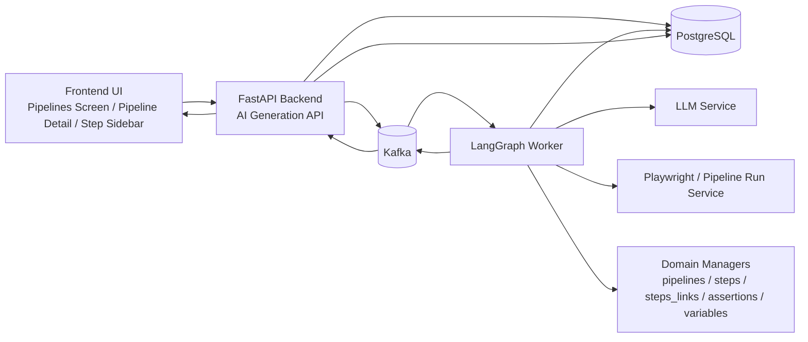

# AI Generation Architecture

## Goal
Step 06 introduces AI-assisted generation of draft test cases and draft refinements based on the logic that currently exists in `/backend/api/dev/test.py`, but moves it into a production-oriented architecture:

- reusable LLM service layer
- Kafka-backed asynchronous execution
- LangGraph agent chain
- preview-first review flow
- explicit database storage for sessions, messages, and previews
- backend-owned apply logic into live draft tables

## Architectural Principles
- The agent **does not write directly** into live draft domain tables.
- Kafka messages are **thin envelopes** with ids and mode, not full pipeline graphs.
- The worker loads context by `session_id`, `project_id`, `pipeline_id`, and `step_id` through tools and managers.
- Preview is the contract between agent output and backend apply logic.
- A preview can be edited by the user before accept.
- Accept updates **draft entities only** and never auto-publishes a pipeline version.
- The first implementation stage supports **one pipeline maximum per session**.
- Step-level generation may only patch the target step or append steps after it.
- The UI shows a shortened trace; the DB stores the full trace.

## High-Level Diagram



## Runtime Components

### 1. Backend API
Responsibilities:
- validate the incoming generation request
- create `ai_generation_sessions`
- publish Kafka request messages
- expose session, messages, preview, accept, and reject endpoints
- consume progress/result messages and persist them
- apply accepted preview data into live draft tables via managers

### 2. LangGraph Worker
Responsibilities:
- read the generation session and target context
- orchestrate subagents
- use tools for pipeline graph reads, step HTML context, and variable metadata
- normalize the final result into preview payload schema
- emit progress and result events through Kafka

### 3. LLM Service
Responsibilities:
- structured generation
- prompt versioning
- retry and timeout policy
- model profile selection
- consistent error envelope
- future observability and token accounting

### 4. Playwright / Pipeline Run Service
Responsibilities:
- provide HTML context when a step snapshot is missing
- optionally execute or partially execute pipeline logic to obtain runtime page state
- remain a tool behind the agent, not a direct UI concern

### 5. Core Domain Managers
Responsibilities:
- read pipeline graph context (`pipelines`, `steps`, `steps_links`, `assertions`)
- read project variable metadata
- apply accepted preview data into live draft tables
- enforce scope restrictions during step-level apply

## LangGraph Subagents

### Planner
Input:
- user input from the session
- generation mode
- project/pipeline/step refs
- available variable templates
- optional HTML context

Output:
- plan of attack
- assumptions
- target scope
- expected preview structure

### QAi Agent
Input:
- planner output
- tools
- HTML/page context
- current draft graph context

Output:
- candidate steps, links, assertions, and variable suggestions
- intermediate trace messages

Rules:
- each generated step should be checked against the planner output
- for `append_after_step`, previous steps are read-only context

### QAi Validator
Input:
- planner output
- candidate preview
- tool outputs and context

Output:
- validation report
- warnings
- final normalized preview payload

## Generation Modes

### `description_to_pipeline`
Used from the Pipelines screen.

Result:
- one preview pipeline draft candidate

### `patch_pipeline_draft`
Used from the pipeline editor when the user wants AI to elaborate existing draft steps and descriptions.

Result:
- preview patch for the current draft pipeline

### `patch_step`
Used from one step in the editor.

Result:
- preview patch for the target step only

Restrictions:
- previous steps are immutable context only

### `append_after_step`
Used from one step in the editor.

Result:
- preview of new following steps and links

Restrictions:
- previous steps are immutable context only
- first generated link from target step is automatic

## Context Loading Strategy
The Kafka message intentionally contains only the routing envelope. The worker reads the rest of the context using internal tools.

### Required context for project-level generation
- session input payload and options
- project variable metadata
- any user-entered helper context

### Required context for pipeline-level generation
- pipeline draft metadata
- steps
- `steps_links`
- assertions
- project variable metadata

### Required context for step-level generation
- target step
- parent pipeline
- surrounding graph context required by the mode
- assertions of the target step
- current step HTML snapshot if present
- otherwise a path to obtain HTML through Playwright / pipeline run service

## Kafka Topics

### Request topic
`qai.ai.cmd.generation-request.v1`

Producer:
- Backend API

Consumer:
- LangGraph worker

### Progress topic
`qai.ai.fct.generation-progress.v1`

Producer:
- LangGraph worker

Consumer:
- Backend API consumer

### Result topic
`qai.ai.fct.generation-result.v1`

Producer:
- LangGraph worker

Consumer:
- Backend API consumer

## Kafka Schemas

### Request schema
```json
{
  "task_id": "uuid",
  "session_id": "uuid",
  "project_id": "uuid",
  "mode": "description_to_pipeline",
  "target_scope": "project",
  "pipeline_id": null,
  "step_id": null,
  "requested_by_user_id": "uuid",
  "trace_id": "uuid",
  "created_at": "2026-05-03T10:00:00Z"
}
```

Notes:
- message is intentionally thin
- session payload, options, and graph context are loaded later from DB and tools

### Progress schema
```json
{
  "task_id": "uuid",
  "session_id": "uuid",
  "status": "running",
  "stage": "planner",
  "message": "Generation plan prepared",
  "progress": 20,
  "payload": {
    "summary": "Plan is ready"
  },
  "created_at": "2026-05-03T10:00:05Z"
}
```

### Result schema
```json
{
  "task_id": "uuid",
  "session_id": "uuid",
  "status": "awaiting_review",
  "preview": {
    "schema_version": 1,
    "kind": "pipeline_draft_create",
    "pipeline": {
      "pipeline_id": null,
      "name": "Login flow",
      "description": "Generated login test case"
    },
    "steps": [],
    "steps_links": [],
    "assertions": [],
    "suggested_variables": []
  },
  "validation_report": {
    "is_valid": true,
    "warnings": [],
    "fallback_used": false
  },
  "created_at": "2026-05-03T10:00:30Z"
}
```

## Preview Payload Contract

The preview contract is the normalized output the agent must produce before the backend can apply anything.

```json
{
  "schema_version": 1,
  "kind": "step_tail_patch",
  "pipeline": {
    "pipeline_id": "uuid",
    "name": "Login flow",
    "description": "Updated login flow"
  },
  "steps": [
    {
      "temp_id": "step_1",
      "step_id": null,
      "name": "Click forgot password",
      "description": "Open reset password form",
      "case": "Reset password form opens",
      "code": {}
    }
  ],
  "steps_links": [
    {
      "temp_id": "link_1",
      "link_id": null,
      "upstream_ref": "existing_step_uuid",
      "downstream_ref": "step_1",
      "condition_type": "always"
    }
  ],
  "assertions": [
    {
      "temp_id": "assert_1",
      "assertion_id": null,
      "step_ref": "step_1",
      "name": "Reset password form is visible",
      "description": null,
      "code": {
        "kind": "text_visible",
        "params": {
          "text": "Reset password"
        }
      }
    }
  ],
  "suggested_variables": [
    {
      "name": "BASE_URL",
      "secret": false,
      "description": "Application base url"
    }
  ]
}
```

### Contract rules
- `schema_version` is mandatory
- `kind` is one of `pipeline_draft_create`, `pipeline_draft_patch`, `step_patch`, or `step_tail_patch`
- preview may contain existing ids and new temp ids together
- `steps` use draft step fields such as `name`, `description`, `case`, and `code`
- `steps_links` are part of the preview contract and cannot be omitted when graph changes are proposed
- `steps_links` use `upstream_ref` and `downstream_ref` to match the draft graph terminology
- `assertions` use `name`, `description`, and `code`
- `suggested_variables` are editable before accept
- secret values are not part of the preview

## API Endpoints

### Create session
`POST /api/qai/v1/projects/{project_id}/ai/generations`

Request example:
```json
{
  "mode": "description_to_pipeline",
  "target_scope": "project",
  "pipeline_id": null,
  "step_id": null,
  "input": {
    "description": "Проверить логин, выход и восстановление пароля"
  },
  "options": {
    "preview_only": true,
    "model_profile": "default"
  }
}
```

### Get session
`GET /api/qai/v1/projects/{project_id}/ai/generations/{session_id}`

Response should include at minimum:
- `status`
- `mode`
- `target_scope`
- `latest_preview_id`
- `latest_message_seq`
- `progress_stage`
- `progress_percent`
- `error_payload`

### Get messages
`GET /api/qai/v1/projects/{project_id}/ai/generations/{session_id}/messages?after_seq=0&limit=50&view=ui`

Rules:
- use `after_seq`, not offset
- order by `seq_no ASC`
- return only messages with `seq_no > after_seq`
- `view=ui` returns only `is_visible_in_ui = true`
- `view=full` returns full audit trace
- frontend polls every few seconds while the session is `queued` or `running`

Example response:
```json
{
  "session_id": "uuid",
  "messages": [
    {
      "seq_no": 13,
      "agent_role": "planner",
      "stage": "planning",
      "message_type": "text",
      "summary_text": "План генерации подготовлен",
      "content_text": "План генерации подготовлен",
      "content_json": null,
      "created_at": "2026-05-03T12:00:01Z"
    }
  ],
  "next_after_seq": 13,
  "has_more": false
}
```

### Get preview
`GET /api/qai/v1/projects/{project_id}/ai/generations/{session_id}/previews/{preview_id}`

### Patch preview
`PATCH /api/qai/v1/projects/{project_id}/ai/generations/{session_id}/previews/{preview_id}`

Editable fields:
- pipeline metadata
- steps
- `steps_links`
- assertions
- `suggested_variables`

### Accept preview
`POST /api/qai/v1/projects/{project_id}/ai/generations/{session_id}/accept`

Rules:
- applies preview through backend managers
- updates live draft tables only
- stores apply summary in the session record

### Reject preview
`POST /api/qai/v1/projects/{project_id}/ai/generations/{session_id}/reject`

## Session Statuses
- `created`
- `queued`
- `running`
- `awaiting_review`
- `accepted`
- `rejected`
- `failed`
- `cancelled`

## Preview Statuses
- `draft`
- `active`
- `accepted`
- `rejected`
- `superseded`

## Validation and Fallback

Backend validation runs both when the worker submits a result and when the user accepts a preview.

### Required checks
- supported preview `schema_version`
- allowed `kind`
- graph referential integrity between steps and links
- allowed mutation scope for the selected mode
- non-empty required fields for pipeline/step names
- no secret values inside `suggested_variables`

### Fallback behavior
If the model returns an incomplete but still reviewable structure:
- build partial preview
- store warnings in `validation_report`
- set `fallback_used = true`
- allow `awaiting_review` if the preview is still usable

If the structure is not safe to apply:
- session becomes `failed`
- preview is not marked active

## Database Responsibilities
- `ai_generation_sessions` stores lifecycle, target refs, and final apply result summary
- `ai_generation_messages` stores full trace with `seq_no`
- `ai_generation_previews` stores editable preview artifacts

Detailed schemas are documented in the tables directory.

## UI Integration Notes
- Pipelines screen hosts project-level `description_to_pipeline`
- Pipeline Detail screen hosts `patch_pipeline_draft`, `patch_step`, and `append_after_step`
- No separate route is added for AI generation
- Preview review is part of the existing editing surfaces
- Polling can stop when the session reaches `awaiting_review` or another terminal status
