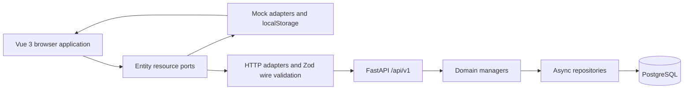

# Platform architecture

## Runtime topology



The app-level provider selects one adapter family with `VITE_API_MODE`. Pages and widgets depend on entity ports and TanStack Vue Query, not directly on `fetch` or `localStorage`.

## Frontend boundaries

The Vue application follows this dependency direction:

```text
app -> pages -> widgets -> features -> entities -> shared
```

- `app` owns startup, route registration, providers, global styles, and mock storage.
- `pages` are route-level compositions.
- `widgets` combine substantial page regions such as the board, access view, and detail panels.
- `features` own forms, validation, and mutation orchestration.
- `entities` own domain types, API ports/adapters, wire schemas, mappers, query keys, and cache helpers.
- `shared` contains transport, configuration, utilities, routes, and business-neutral UI primitives.

TanStack Vue Query owns server state. Route query parameters own reproducible board and access-list filters. Dialog, sheet, and form state stays local. Theme, card display choices, and collapsed Kanban columns use browser storage.

## Backend boundaries

The backend is one deployable FastAPI application with two logical services: `authz` owns identity, memberships, restrictions, and named policy decisions; `pms` owns project-management resources and behavior. Both use the same layered request path and transaction infrastructure.

FastAPI uses a layered request path:

```text
router -> dependency/authentication -> manager -> repository -> PostgreSQL
```

- Routers declare methods, paths, Pydantic request/response models, and dependencies.
- HTTP dependencies decode the bearer identity, provision or load the `users` row, enforce the in-memory per-user rate limit, and resolve project membership.
- Managers enforce roles, archive rules, references, optimistic versions, domain invariants, and transaction boundaries.
- Repositories issue scoped async SQLAlchemy queries.
- SQLAlchemy mappings define 12 active PostgreSQL tables.

The application also adds an `X-Correlation-ID` to each response, exposes `/healthcheck`, `/metrics`, `/docs`, and `/openapi.json`, and converts failures to the common error envelope.

## Identity and authorization

The backend accepts OAuth2 bearer tokens. The token email resolves a persistent `users` record; an unknown email is provisioned with the email as its initial display name. Disabled users are rejected.

Project access is stored in `project_users`. Workspace administration is stored in `workspace_users`. A `service_users` row may narrow, but never elevate, a project role for one service. The named authorization policy and role matrix are documented in the [Authz API](backend/services/authz/api.md#authorization-policy).

The platform has two related authorization surfaces:

- PMS dependencies protect project-management routes under `/workspaces/{workspace_slug}/projects/...`.
- Authorization routes under `/workspaces/{workspace_id}/members`, `/projects/{project_id}/members`, and `/authorization/check` administer or evaluate access records.

Current PMS workspace actors are derived from the `workspace_slug` route and authenticated user; project list/create do not query `workspace_users`. Project resource access always requires a `project_users` row, even when `pms_projects.access=workspace`. Workspace membership and the project visibility flag therefore do not currently grant implicit PMS project access.

## Persistence and consistency

PostgreSQL is the backend transactional source of truth. A request-scoped async session commits on success and rolls back on failure. The browser mock uses a versioned `localStorage` database instead.

The implementation uses positive integer entity versions and a project `board_version`. Membership, service restriction, agent, state-order, and card-move commands have explicit version checks in backend JSON contracts. Create operations for projects, states, work items, and epics use a client-supplied UUID as idempotent command identity.

The database mappings exist, but `backend/migrations/postgres/versions/` contains no checked-in Alembic revisions. A clean PostgreSQL database cannot be provisioned from the repository alone.

## HTTP integration status

The backend contract in [API reference](backend/api.md) is authoritative for FastAPI. The current frontend HTTP adapters differ in these verified areas:

| Area | Frontend HTTP expectation | FastAPI implementation |
| --- | --- | --- |
| Session | `POST /auth/session/resolve` and session-shaped `GET /auth/me` | No resolve route; `GET /auth/me` returns a user only |
| Authentication transport | Cookie credentials; no bearer header is added by `apiClient` | OAuth2 bearer token is required |
| Project list | `archived=true|false` | `status=active|archived` |
| Project create/archive | Create omits `id`; archive sends `{}` | Create requires `id`; archive requires exact `confirmation_name` |
| Project initialization | Mock makes `Бэклог` the default state | FastAPI makes `К выполнению` the default state |
| Board read | Flat `states`, `work_items`, `epics`, `members`, and `columns` | Columns embed `state`, `work_items`, and page data; lookups are under `included` |
| Card model/move | `sort_order`, `from_state_id`, `board_version`, and board-shaped move response | `rank`, expected entity/board versions, and a dedicated move response |
| Epics | UI model uses name, color, direct work-item IDs, and `/work-items/batch` | Backend model uses title, state, priority, rank, and POST/DELETE membership endpoints |
| States | UI uses `order`, `state_ids`, and no expected board version | Backend uses `position`, `ordered_state_ids`, and `expected_board_version` |


These are documentation gaps in the integrated product, not inferred defects in either standalone adapter. Mock mode remains the default and avoids these HTTP mismatches.

## Active and inactive infrastructure

Active runtime dependencies are Vue, TanStack Vue Query, FastAPI, PostgreSQL, JWT/bcrypt authentication helpers, and Prometheus instrumentation.

Generic Kafka, Redis, and storage libraries remain under `backend/libs/`, but they are not wired into the PMS application. There is no active Kafka producer/consumer, outbox, cache, LLM client, realtime channel, file storage, or worker process.

## Related documentation

- [Frontend](frontend/README.md)
- [Backend](backend/README.md)
- [System flows](backend/flows.md)
- [Database](database/README.md)
