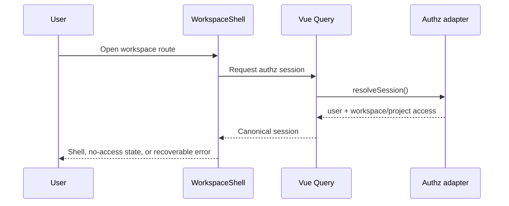

# Authz flows

## Frontend startup and session gate

In mock mode, session resolution reads the browser database. The shell blocks protected content while resolving, shows a dedicated disabled/identity/service failure state on error, and shows “access not assigned” when both access lists are empty. Successful state determines workspace navigation and the visible user identity.

HTTP mode currently expects `POST /auth/session/resolve`; FastAPI does not expose that route. This prevents the current shell from completing against the backend without an adapter or backend contract change.

## Workspace membership

1. Load all current workspace memberships and require the actor to be owner/admin.
2. Require the target user to exist and be active.
3. Enforce the actor role ceiling and dedicated owner-transfer rule.
4. On update/revoke, compare `expected_version` and protect the last owner.
5. Commit and emit a privacy-safe authorization log/metric.

## Project membership

The same pattern requires project admin authority and validates the project/workspace relationship. The last admin is protected. A role cannot be reduced below one of its stored service restrictions. Revoking project membership cascades service restrictions through the foreign key.

## Service restriction

A restriction is an override for one `(project membership, service_id)`. Its role may only narrow project access. PUT creates when `expected_version` is omitted, or updates the matching version when present. DELETE restores inherited project access.

## Named decision

`POST /authorization/check` loads current database state for the authenticated subject, validates the action/resource scope, applies a project or workspace role rank, optionally applies a service restriction, and returns allow/deny with policy version `v1`. Decisions are not cached.

## PMS handoff

Nested PMS routes load the authenticated user, routed project, and matching `project_users` row before entering the PMS router. PMS managers then apply resource-specific capability and ownership rules. Project list/create is the current exception: it derives workspace scope from the route without reading `workspace_users`.

## Related documentation

- [Authz overview](README.md)
- [Authz API](api.md)
- [Cross-service flows](../../flows.md)
- [PMS flows](../pms/flows.md)
- [Frontend](../../../frontend/README.md)
