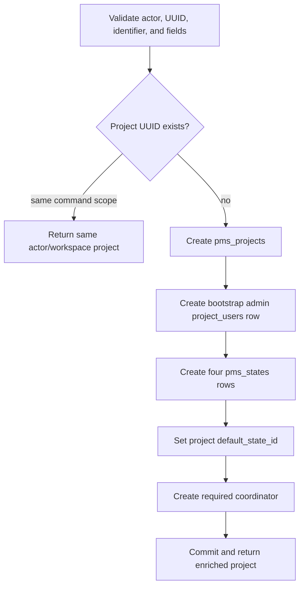
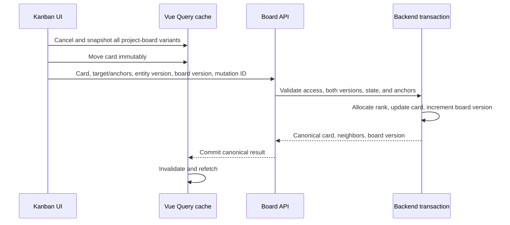

# PMS flows

## Project creation

FastAPI creates `Бэклог`, `К выполнению`, `В работе`, and `Готово`, with `К выполнению` as default. The required coordinator uses model `qwen3:32b`, project memory, 50 maximum steps, project approval policy, and the `task-management` system tool.

The browser mock performs the analogous setup but makes `Бэклог` the default and uses its own generated entity IDs. Both paths add the creator as project admin.

## Board read

1. The frontend derives `search`, `priority`, `epic`, and `assignee` from route query parameters.
2. The board query calls the selected `BoardApi` implementation.
3. FastAPI parses comma-separated filters and verifies project membership.
4. The manager loads ordered states, independently bounded card pages per state, assignees, up to 100 epic picker rows, members, project aggregates, and the current user's preferences.
5. Missing preferences are inserted lazily during the read.
6. The response includes the project permission set and project `board_version`.
7. The frontend renders loading, error, read-only, or Kanban content and caches the domain model.

The FastAPI board response is column-oriented; the current frontend HTTP mapper expects a different flat representation. Mock mode directly returns the flat model.

## Work-item creation, editing, and movement

### Create

- The user submits a title in a selected board column.
- Backend create validates the optional state, epic, members, dates, and HTML; missing state falls back to `default_state_id`.
- The project allocates the next sequence and exposes `{PROJECT_IDENTIFIER}-{sequence_id}`.
- The server allocates an opaque rank, inserts assignees, and returns the complete work item.
- The frontend inserts it into matching board caches and invalidates related queries.

### Patch

The detail component sends only changed fields. Title is saved on blur, rich text by explicit action, and properties immediately. Backend sanitizes HTML, validates final date ordering and project-scoped references, increments the work-item version, and increments `board_version` when the state changes.

### Optimistic move

On failure the frontend restores every saved board-query snapshot, shows an error, and still invalidates for reconciliation. The explicit move dialog offers start/end placement for users who do not drag.

## State lifecycle

- Create validates a client UUID, unique case-insensitive name, color, group, and optional insertion point.
- Setting a new default clears the previous marker and updates `pms_projects.default_state_id`.
- Reorder requires the complete unique ID set and current `expected_board_version`.
- Delete rejects the last state and current default. If cards or epics exist, a replacement is mandatory. Dependents move before the state is deleted and remaining positions are compacted.
- Every structural change advances the project board version.

## Epic lifecycle and progress

FastAPI stores epics as workflow entities with sequence identifiers, state, priority, assignees, dates, rank, rich text, and version. Progress is calculated at query time from linked work items: a card counts complete when its state group is `completed`.

Adding cards validates 1–100 unique project card IDs. When `move_from_other_epics=false`, a card already owned by another epic causes a conflict; when true, its single `epic_id` is replaced. Removing a card clears that field. Deleting an epic first clears all links, while `ON DELETE SET NULL` is a database safeguard.

The frontend mock presents a simpler epic model with color and direct `workItemIds`; its HTTP adapter is not yet mapped to the FastAPI model.

## Agent lifecycle

- Project creation ensures exactly one coordinator through a unique partial index and manager guard.
- Any project member can list or read agents.
- Project admins on active projects can create and configure workers.
- Update, enable, disable, and archive commands compare the expected agent version and use a version condition on the write.
- A coordinator cannot be disabled or archived; the database also requires coordinator status to remain `active`.
- Archived workers remain readable, cannot be modified or re-enabled, and may free their name for reuse.

There is no execution engine behind agent or session UI in the current service.

## Archive and read-only behavior

Archiving sets `pms_projects.archived_at`; it does not delete project data. Domain manager mutations call `require_writable` and are rejected for archived projects. Project restore and personal board-preference changes remain available. Frontend widgets independently hide or disable mutating controls and show an archive/read-only notice.

## Related documentation

- [PMS overview](README.md)
- [PMS API](api.md)
- [Cross-service flows](../../flows.md)
- [Authz flows](../authz/flows.md)
- [Database](../../../database/README.md)
- [Frontend](../../../frontend/README.md)
