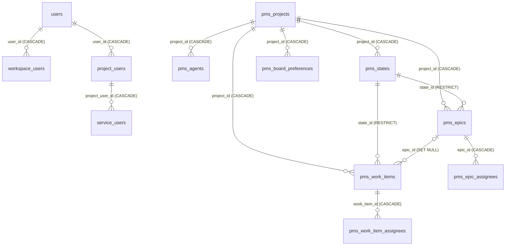

# Database relationships and schema status

## Provisioning status

The backend declares 12 PostgreSQL tables through SQLAlchemy. This reference describes those mappings exactly; it does not claim that a deployed database has the same schema.

`backend/migrations/postgres/versions/` is empty. No checked-in Alembic revision creates or upgrades the documented tables. Schema provisioning for a clean database is therefore an explicit documentation and deployment gap.

Every mapped table inherits an `id UUID PRIMARY KEY NOT NULL` column whose value is generated by application-side `uuid4()`. It has no server default. `updated_at` columns that say “ORM `now()` on update” rely on SQLAlchemy updates, not a PostgreSQL trigger.

## Relationship overview

Not every logical relation is a database foreign key. Workspaces are externally owned. `project_users.project_id`, project/default-state and creator fields, board-preference users, and assignee users are validated by application logic rather than referential constraints.

## Application-enforced invariants

The schema does not independently enforce every public rule. Managers additionally enforce:

- workspace/project scope consistency and active user membership;
- role ceilings, last-owner/admin protection, and non-elevating service restrictions;
- archive read-only behavior;
- exact project state ownership and one manager-visible default;
- unique/limited assignees drawn from project members;
- supported enum values and hex colors where no check exists;
- positive expected versions and board-version comparisons;
- HTML sanitization and 100 KiB storage limit;
- valid rank anchors and card/epic project ownership.

## Related documentation

- [Table index](README.md)
- [Architecture](../architecture.md)
- [Backend](../backend/README.md)
- [API reference](../backend/api.md)
- [System flows](../backend/flows.md)
